## Overview

The Unreplied Chats AI Agent automatically monitors your team's WhatsApp conversations and identifies which ones need immediate attention. It classifies chats by urgency and sends alerts to keep your team responsive.

## How It Works

```mermaid
graph LR
    A[WhatsApp Chats] --> B[AI Analysis]
    B --> C{Priority Level}
    C -->|Critical| D[🔴 Immediate Alert]
    C -->|Important| E[🟡 Team Notification]
    C -->|Normal| F[📋 Dashboard View]
```



1. **AI Monitors**: Continuously scans all team conversations
2. **Analyzes Context**: Understands message content and urgency signals
3. **Classifies Priority**: Assigns critical, important, or normal status
4. **Alerts Team**: Sends notifications via WhatsApp and dashboard

## Priority Classifications

| Level | Indicator | Triggers |
|-------|-----------|----------|
| 🔴 Critical | Red label | Angry customer, urgent request, time-sensitive |
| 🟡 Important | Yellow label | Follow-up needed, question asked, buying signals |
| 🟢 Normal | Green label | General conversation, informational |

### What Makes a Chat Critical?

AI detects urgency signals like:
- Frustration or complaint language
- Words like "urgent", "ASAP", "immediately"
- Multiple unreplied messages from same contact
- High-value deal indicators
- Time-sensitive requests (meetings, deadlines)

## Setting Up the Agent

<Steps>
  <Step title="Enable AI Agent">
    Go to **Settings** → **AI Features** → **Unreplied Chats Agent**
    
    Toggle **Enable** to ON.
  </Step>
  
  <Step title="Configure Alert Recipients">
    Select who receives alerts:
    - Individual team members
    - Team leads/managers
    - Specific teams
  </Step>
  
  <Step title="Set Alert Frequency">
    Choose how often to receive summary alerts:
    - Every 3 hours (recommended)
    - Every 6 hours
    - Daily
  </Step>
  
  <Step title="Customize Thresholds">
    Set what triggers critical alerts:
    - Unreplied duration (e.g., 2+ hours)
    - Number of unreplied messages (e.g., 3+)
    - Specific keywords
  </Step>
</Steps>

## Alert Types

### In-App Labels

Visual labels appear in Revenue Inbox and the extension:

- 🔴 **Critical** - Needs immediate response
- 🟡 **Important** - Should respond soon
- Shows next to contact name in chat list

### WhatsApp Summaries

Designated admins receive WhatsApp messages every 3 hours:

```
📊 Unreplied Chats Summary

🔴 Critical (2):
• John Smith - "Need urgent help with order"
• Sarah Jones - "Meeting in 30 mins, need update"

🟡 Important (5):
• Mike Brown - Asked about pricing (2h ago)
• Lisa Chen - Follow-up on proposal
• [+3 more]

Total unreplied: 12 chats
```

### Dashboard View

See all unreplied chats organized by priority:
1. Go to **Revenue Inbox**
2. Click **Unreplied** filter
3. Sort by **Priority** (Critical first)

## Team Workflow

### For Sales Reps

1. **Check your dashboard** at start of day
2. **Handle critical chats** first (red labels)
3. **Work through important** chats next
4. **AI keeps prioritizing** as new messages arrive

### For Managers

1. **Review summary alerts** every 3 hours
2. **Identify bottlenecks** - who has too many unreplied?
3. **Reassign conversations** if needed
4. **Coach team** on response time goals

## Configuration Options

### Alert Settings

| Setting | Options | Default |
|---------|---------|---------|
| Enable Agent | On/Off | Off |
| Alert frequency | 1h, 3h, 6h, 12h, 24h | 3h |
| Alert channel | WhatsApp, Email, Both | WhatsApp |
| Recipients | Select users | Admins only |

### Priority Thresholds

| Threshold | Default | Customizable |
|-----------|---------|--------------|
| Critical after | 2 hours | ✅ |
| Important after | 1 hour | ✅ |
| Multiple messages | 3+ | ✅ |
| Keywords | Predefined | ✅ Add custom |

### Custom Keywords

Add industry-specific urgency keywords:

**Default critical keywords:**
- urgent, asap, immediately, emergency, help

**Add custom keywords:**
- Your product/service terms
- Competitor mentions
- Cancellation terms

## Best Practices

<Tip>
  **Set realistic SLAs**: Configure alert thresholds based on your team's capacity. Too sensitive = alert fatigue. Too lenient = missed opportunities.
</Tip>

### Response Time Goals

| Chat Type | Target Response |
|-----------|-----------------|
| Critical | < 30 minutes |
| Important | < 2 hours |
| Normal | < 24 hours |

### Team Distribution

If one rep has too many unreplied:
1. Identify in dashboard
2. Reassign conversations to available reps
3. Investigate root cause (too many leads? training needed?)

## FAQ

<AccordionGroup>
  <Accordion title="Does AI read all my messages?">
    AI analyzes message content to determine priority but doesn't store messages. Processing happens in real-time and data isn't retained.
  </Accordion>
  
  <Accordion title="Can I turn off AI classification?">
    Yes, disable the Unreplied Chats Agent in settings. You'll still see unreplied chats but without AI prioritization.
  </Accordion>
  
  <Accordion title="Why is a chat marked critical incorrectly?">
    AI isn't perfect. You can manually adjust priority or provide feedback to improve accuracy. Report false positives to help train the model.
  </Accordion>
  
  <Accordion title="Does this work with WABA?">
    Yes, the AI Agent monitors both regular WhatsApp and WABA conversations.
  </Accordion>
</AccordionGroup>

## Metrics & Reporting

Track your team's response performance:

- **Average response time** - Overall and by rep
- **Critical chat resolution** - Time to first reply on critical
- **Unreplied rate** - Percentage of chats unreplied > threshold
- **Trend analysis** - Week-over-week improvements

Access these in **Analytics** → **Response Metrics**.

## Next Steps

<CardGroup cols={2}>
  <Card title="AI Reply Suggestions" icon="wand-magic-sparkles" href="/automation/ai/reply-suggestions">
    Get help crafting responses
  </Card>
  <Card title="Revenue Inbox" icon="inbox" href="/revenue-inbox/overview">
    Manage all team conversations
  </Card>
</CardGroup>
