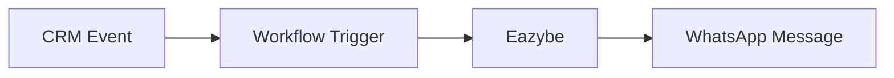

## Overview

Workflows allow you to automatically send WhatsApp messages when events occur in your CRM.

## How It Works

**Example**: When a deal moves to "Proposal Sent" in HubSpot, automatically send a WhatsApp message to the contact.

## Supported CRMs

| CRM | Workflow Support |
|-----|------------------|
| HubSpot | ✅ Full support |
| Zoho CRM | ✅ Full support |
| Salesforce | 🔜 Coming soon |
| Pipedrive | 🔜 Coming soon |

## Prerequisites

<Check>WABA connected to Eazybe</Check>
<Check>CRM integration active</Check>
<Check>Approved message templates</Check>
<Check>CRM workflow/automation access</Check>

## Common Use Cases

| Use Case | Trigger | Message |
|----------|---------|---------|
| **Welcome** | New contact created | Welcome message |
| **Follow-up** | Deal stage change | Status update |
| **Reminder** | Task due date | Appointment reminder |
| **Win/Loss** | Deal won/lost | Thank you / feedback request |
| **Nurture** | Time-based | Re-engagement message |

## Best Practices

<Tip>
  Always use approved WABA templates for workflow messages - personal messages from workflows will fail.
</Tip>

### Do's ✅
- Test workflows with your own contact first
- Use merge fields for personalization
- Set up error notifications
- Monitor delivery rates

### Don'ts ❌
- Send too frequently (spam risk)
- Use non-approved templates
- Forget to map variables correctly
- Ignore delivery failures

## Next Steps

<CardGroup cols={2}>
  <Card title="HubSpot Workflows" icon="hubspot" href="/automation/workflows/hubspot-workflows">
    Set up HubSpot automation
  </Card>
  <Card title="Zoho Workflows" icon="z" href="/automation/workflows/zoho-workflows">
    Set up Zoho automation
  </Card>
</CardGroup>
