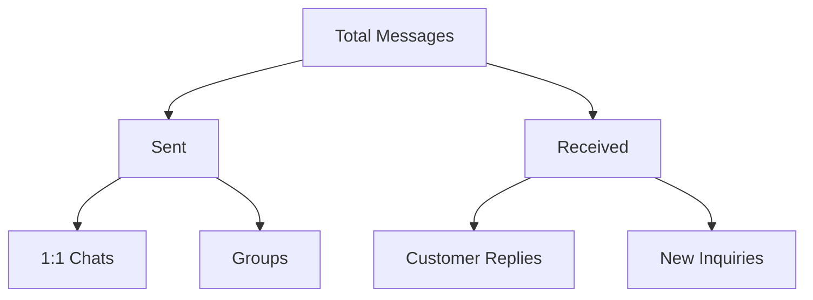

## Overview

Conversation Analytics breaks down your WhatsApp communication by type, helping you understand how your team engages with customers across different channels.

## Conversation Types

### 1:1 Chats
Individual conversations between your team and customers:

| Metric | Description |
|--------|-------------|
| **Total 1:1 Conversations** | Number of unique individual chats |
| **Messages Sent** | Outbound messages in 1:1 chats |
| **Messages Received** | Inbound messages in 1:1 chats |
| **Avg Messages per Chat** | Conversation depth indicator |
| **First Response Time** | Time to initial reply |

### Group Chats
Team or broadcast group activity:

| Metric | Description |
|--------|-------------|
| **Active Groups** | Groups with recent activity |
| **Messages to Groups** | Total group messages sent |
| **Group Reach** | Total members across groups |
| **Engagement Rate** | Replies per group message |

## Message Flow Analysis

## Key Insights

<CardGroup cols={2}>
  <Card title="Conversation Health" icon="heart-pulse">
    Track the ratio of sent vs received messages. Healthy conversations have balanced flow.
  </Card>
  <Card title="Engagement Depth" icon="layer-group">
    Monitor messages per conversation to identify meaningful vs shallow interactions.
  </Card>
  <Card title="Channel Mix" icon="diagram-project">
    Understand the split between 1:1 and group communication.
  </Card>
  <Card title="Response Patterns" icon="wave-square">
    Identify when customers are most responsive to optimize timing.
  </Card>
</CardGroup>

## Tracking Follow-ups

Follow-up messages are crucial for sales success:

| Follow-up Metric | Target | Why |
|------------------|--------|-----|
| **Follow-up Rate** | > 80% | Ensure no lead falls through |
| **Avg Follow-ups per Lead** | 3-5 | Persistence without annoyance |
| **Time Between Follow-ups** | 2-3 days | Stay top of mind |
| **Follow-up Response Rate** | > 30% | Measure effectiveness |

## Best Practices

<Tip>
**The 80/20 Rule:** Focus on the 20% of conversations that drive 80% of your results. Use analytics to identify high-value interactions.
</Tip>

### Conversation Quality Indicators

High-quality conversations typically show:
- Balanced back-and-forth (not one-sided)
- Multiple exchanges over time
- Progression through sales/support stages
- Positive resolution or next steps

### Red Flags to Watch

- **High send, low receive** - Messages may not be relevant
- **Single-message chats** - Follow-up needed
- **Long response times** - Service issues
- **Many unanswered messages** - Targeting problems
