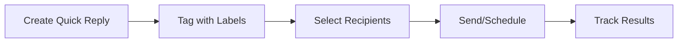

## Supercharge Your WhatsApp Workflow

Eazybe provides a powerful suite of productivity tools designed to help sales teams communicate faster, smarter, and more efficiently on WhatsApp.

<Frame>
  
</Frame>

## Key Features

<CardGroup cols={2}>
  <Card title="Quick Replies" icon="bolt" href="/productivity/quick-replies">
    Save time with pre-written message templates that you can send with one click. Perfect for common responses and FAQs.
  </Card>
  <Card title="Scheduled Messages" icon="clock" href="/productivity/scheduled-messages">
    Plan your outreach in advance. Schedule messages to be sent at optimal times, even when you're offline.
  </Card>
  <Card title="Bulk Messaging" icon="paper-plane" href="/productivity/bulk-messaging">
    Send personalized messages to multiple contacts at once using labels and quick replies.
  </Card>
  <Card title="Message Templates" icon="file-lines" href="/productivity/message-templates">
    Create reusable templates with dynamic fields for personalized communication at scale.
  </Card>
  <Card title="Privacy Blur" icon="eye-slash" href="/productivity/privacy-blur">
    Protect sensitive information by blurring contact names and profile pictures on screen.
  </Card>
  <Card title="Click to Chat" icon="message" href="/productivity/click-to-chat">
    Start conversations with any phone number instantly, without saving to contacts first.
  </Card>
</CardGroup>

## How It Works

## Time Saved Per Day

Teams using Eazybe's productivity tools report significant time savings:

| Task | Without Eazybe | With Eazybe | Time Saved |
|------|---------------|-------------|------------|
| **Common responses** | 2 min/message | 5 sec/message | 95% |
| **Follow-up reminders** | Manual tracking | Automated | 100% |
| **Bulk outreach** | 30 min/50 contacts | 2 min/50 contacts | 93% |
| **Contact lookup** | 1 min/contact | Instant | 99% |

## Getting Started

<Steps>
  <Step title="Open Eazybe Extension">
    Click the Eazybe icon in your Chrome browser while on WhatsApp Web
  </Step>
  <Step title="Create Your First Quick Reply">
    Click the Quick Reply button and save your most common response
  </Step>
  <Step title="Organize with Labels">
    Tag your contacts with labels for targeted messaging
  </Step>
  <Step title="Start Saving Time">
    Use quick replies and scheduled messages to automate your workflow
  </Step>
</Steps>

<Tip>
**Pro Tip:** Create shared quick replies that your entire team can use for consistent messaging across your organization.
</Tip>
