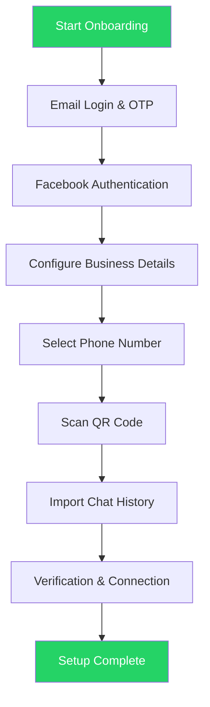

WhatsApp Coexistence enables businesses to connect their active WhatsApp Business App phone number to the WhatsApp Cloud API without losing chats, contacts, or requiring re-registration. This guide walks you through the complete onboarding process.

## What You'll Do

- Connect your WhatsApp Business App number to the Cloud API
- Import your existing contacts and chat history
- Complete verification with Meta Business Platform
- Start using both the WhatsApp Business App and API simultaneously

## Before You Start

<CardGroup cols={2}>

<Card title="WhatsApp Business App" icon="whatsapp">
  Must be version **2.24.17 or newer**. Personal WhatsApp numbers are not supported.
</Card>

<Card title="Active Phone Number" icon="phone">
  Regular WhatsApp activity with no Meta restrictions or policy violations.
</Card>

<Card title="Meta Business Account" icon="meta">
  A Meta Business Account with admin access to a Facebook Business Page.
</Card>

<Card title="Eligible Number" icon="check">
  Not linked to another WhatsApp API provider. Numbers from Nigeria and South Africa may have restrictions.
</Card>

</CardGroup>

<Warning>
Inactive or restricted numbers frequently fail setup. Ensure your WhatsApp Business account shows active usage with real 1:1 conversations for at least 3-7 days before attempting Coexistence onboarding.
</Warning>

## Flow Overview

## Step-by-Step Onboarding Process

<Steps>

<Step title="Email Login">
Enter your email address and log in with your account.

<Frame>
  
</Frame>
</Step>

<Step title="OTP Verification">
Enter the OTP (One-Time Password) that will be sent to your Gmail account inbox.

<Frame>
  
</Frame>
</Step>

<Step title="Get Started">
Click **Add Number** to proceed with the embedded sign-up process.

<Frame>
  
</Frame>
</Step>

<Step title="Facebook Login">
Enter your Facebook login credentials. You can use **Continue as** if your login is already saved.

<Frame>
  
</Frame>
</Step>

<Step title="Review Permissions">
Review the requested permissions and click **Continue** to proceed.

<Frame>
  
</Frame>
</Step>

<Step title="Enter Business Details">
Fill in your business details as required by the form.

<Frame>
  
</Frame>
</Step>

<Step title="Select Business Portfolio">
Choose an existing business portfolio or create a new one.

<Note>
Always create a **NEW WABA account** for Coexistence to ensure fresh usage and a healthy flow.
</Note>

<Frame>
  
</Frame>
</Step>

<Step title="Choose Onboarding Method">
Select one of the two available options:

<Tabs>
<Tab title="Existing Number">
Connect your existing WhatsApp Business number to the Cloud API.
</Tab>
<Tab title="New Number">
Start with a new WhatsApp contact number.
</Tab>
</Tabs>

**Important constraints:**
- The number should not be currently linked to any other partner
- The number should be a new or an existing WhatsApp Business number
- The number should not be blocked from Meta

<Frame>
  
</Frame>
</Step>

<Step title="Enter Phone Number">
Choose your country code, enter your phone number, and click **Next**.

<Frame>
  
</Frame>
</Step>

<Step title="Scan QR Code">
A WhatsApp message will be sent to your number. Click **Scan QR Code** to scan the QR code displayed on the main screen.

<Frame>
  
</Frame>
</Step>

<Step title="Chat History Import">
Choose what to import:

- **Contacts**: Imported automatically
- **1:1 Chats**: Optional, up to 6 months
- **Media**: Optional, up to 2 weeks

<Note>
Group chats are not imported during Coexistence onboarding.
</Note>

<Frame>
  
</Frame>
</Step>

<Step title="Verification & Connection">
Wait for the account verification to complete. The system will take some time to connect your account.

<Frame>
  
</Frame>
</Step>

<Step title="Complete Setup">
Click **Finish** when the setup is done. Your WhatsApp Business number is now connected to the Cloud API.

<Frame>
  
</Frame>
</Step>

</Steps>

## What is WhatsApp Coexistence?

Coexistence allows businesses to:

- Connect the WhatsApp Business App to the Cloud API
- Continue using the Business App normally
- Sync messages and contacts into a Cloud API platform
- Avoid re-registering the number
- Preserve the Verified badge (if applicable)

### Key Benefits

| Benefit | Description |
|---------|-------------|
| Dual Access | Use the same phone number across both the WhatsApp Business App and API |
| Real-time Sync | Messages and contacts synchronize automatically |
| Hybrid Approach | Use mobile app for 1-to-1 chats, API for broadcast messaging |
| Data Preservation | Preserve chat history and contacts without data loss |
| Familiar Interface | Maintain access to the WhatsApp Business App interface |

<Tip>
This is the safest method to migrate to Cloud API without losing data.
</Tip>

## Troubleshooting

<AccordionGroup>

<Accordion title="Integration Failed">
**Common reasons:**
- Old WhatsApp version (must be 2.24.17 or newer)
- Number inactivity
- Meta restrictions on the account
- No Facebook Page admin access

**Solution:** Use another number that has active WhatsApp Business usage with no past violations.
</Accordion>

<Accordion title="Chat History Did Not Import">
If chat import fails:

1. Open WhatsApp Business App
2. Go to **Settings** > **Business Tools** > **WhatsApp Business Platform**
3. Tap **Disconnect**
4. Restart the Coexistence onboarding process

<Warning>
If you manually skipped history import initially, you must fully offboard and onboard again to import chat history.
</Warning>
</Accordion>

<Accordion title="Number Has Meta Restrictions">
**Symptoms:**
- Coexistence onboarding fails instantly
- QR code doesn't complete
- No "Connect to Business Platform" message appears

**Solution:** Use a new number with:
- Zero policy issues
- Frequent legitimate WhatsApp Business activity
</Accordion>

</AccordionGroup>

## Frequently Asked Questions

<AccordionGroup>

<Accordion title="Can I use a personal WhatsApp number?">
No. Only WhatsApp Business App numbers are allowed for Coexistence.
</Accordion>

<Accordion title="Will my chats stay in my phone app?">
Yes. Nothing is deleted from the WhatsApp Business App. Your existing chats remain accessible.
</Accordion>

<Accordion title="Can I still use the WhatsApp Business App after Coexistence?">
Yes, you can continue using the WhatsApp Business App normally while also using the Cloud API.
</Accordion>

</AccordionGroup>

## Next Steps

<CardGroup cols={2}>

<Card title="WABA Overview" icon="book" href="/waba/overview">
  Learn more about WhatsApp Business API capabilities
</Card>

<Card title="Coexistence Mode" icon="code-branch" href="/getting-started/coexistence-mode">
  Understand how Coexistence mode works
</Card>

<Card title="Connect WABA" icon="plug" href="/waba/connect-waba">
  Connect your WhatsApp Business Account to Eazybe
</Card>

<Card title="Troubleshooting" icon="screwdriver-wrench" href="/troubleshooting/common-issues">
  Get help with common issues
</Card>

</CardGroup>
