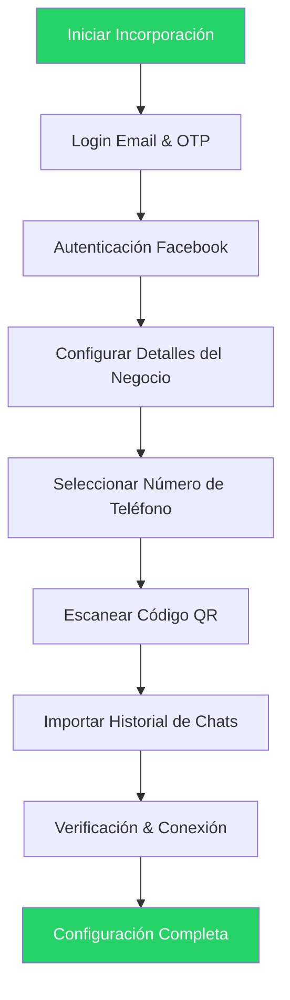

WhatsApp Coexistence permite a las empresas conectar su número activo de WhatsApp Business App a la WhatsApp Cloud API sin perder chats, contactos o necesitar re-registro. Esta guía te lleva a través del proceso completo de incorporación.

## Lo Que Harás

- Conectar tu número de WhatsApp Business App a la Cloud API
- Importar tus contactos e historial de chat existentes
- Completar la verificación con Meta Business Platform
- Comenzar a usar tanto el WhatsApp Business App como la API simultáneamente

## Antes de Empezar

<CardGroup cols={2}>

<Card title="WhatsApp Business App" icon="whatsapp">
  Debe ser versión **2.24.17 o superior**. Los números personales de WhatsApp no son compatibles.
</Card>

<Card title="Número Activo" icon="phone">
  Actividad regular en WhatsApp sin restricciones de Meta ni violaciones de políticas.
</Card>

<Card title="Cuenta Meta Business" icon="meta">
  Una Cuenta Meta Business con acceso de administrador a una Página de Facebook Business.
</Card>

<Card title="Número Elegible" icon="check">
  No vinculado a otro proveedor de API de WhatsApp. Los números de Nigeria y Sudáfrica pueden tener restricciones.
</Card>

</CardGroup>

<Warning>
Los números inactivos o restringidos frecuentemente fallan en la configuración. Asegúrate de que tu cuenta de WhatsApp Business muestre uso activo con conversaciones reales 1:1 durante al menos 3-7 días antes de intentar la incorporación a Coexistence.
</Warning>

## Visión General del Flujo

## Proceso de Incorporación Paso a Paso

<Steps>

<Step title="Inicio de Sesión por Email">
Ingresa tu dirección de email e inicia sesión con tu cuenta.

<Frame>
  
</Frame>
</Step>

<Step title="Verificación OTP">
Ingresa el OTP (Contraseña de Un Solo Uso) que se enviará a tu bandeja de entrada de Gmail.

<Frame>
  
</Frame>
</Step>

<Step title="Comenzar">
Haz clic en **Agregar Número** para proceder con el proceso de registro integrado.

<Frame>
  
</Frame>
</Step>

<Step title="Inicio de Sesión en Facebook">
Ingresa tus credenciales de inicio de sesión de Facebook. Puedes usar **Continuar como** si tu inicio de sesión ya está guardado.

<Frame>
  
</Frame>
</Step>

<Step title="Revisar Permisos">
Revisa los permisos solicitados y haz clic en **Continuar** para proceder.

<Frame>
  
</Frame>
</Step>

<Step title="Ingresar Detalles del Negocio">
Completa los detalles de tu negocio según lo requiera el formulario.

<Frame>
  
</Frame>
</Step>

<Step title="Seleccionar Portafolio de Negocios">
Elige un portafolio de negocios existente o crea uno nuevo.

<Note>
Siempre crea una **NUEVA cuenta WABA** para Coexistence para asegurar un uso fresco y un flujo saludable.
</Note>

<Frame>
  
</Frame>
</Step>

<Step title="Elegir Método de Incorporación">
Selecciona una de las dos opciones disponibles:

<Tabs>
<Tab title="Número Existente">
Conecta tu número existente de WhatsApp Business a la Cloud API.
</Tab>
<Tab title="Nuevo Número">
Comienza con un nuevo número de contacto de WhatsApp.
</Tab>
</Tabs>

**Restricciones importantes:**
- El número no debe estar actualmente vinculado a ningún otro socio
- El número debe ser un número nuevo o existente de WhatsApp Business
- El número no debe estar bloqueado por Meta

<Frame>
  
</Frame>
</Step>

<Step title="Ingresar Número de Teléfono">
Elige tu código de país, ingresa tu número de teléfono y haz clic en **Siguiente**.

<Frame>
  
</Frame>
</Step>

<Step title="Escanear Código QR">
Se enviará un mensaje de WhatsApp a tu número. Haz clic en **Escanear Código QR** para escanear el código QR mostrado en la pantalla principal.

<Frame>
  
</Frame>
</Step>

<Step title="Importación del Historial de Chats">
Elige qué importar:

- **Contactos**: Importados automáticamente
- **Chats 1:1**: Opcional, hasta 6 meses
- **Medios**: Opcional, hasta 2 semanas

<Note>
Los chats grupales no se importan durante la incorporación a Coexistence.
</Note>

<Frame>
  
</Frame>
</Step>

<Step title="Verificación & Conexión">
Espera a que se complete la verificación de la cuenta. El sistema tomará algún tiempo para conectar tu cuenta.

<Frame>
  
</Frame>
</Step>

<Step title="Completar Configuración">
Haz clic en **Finalizar** cuando la configuración esté terminada. Tu número de WhatsApp Business ahora está conectado a la Cloud API.

<Frame>
  
</Frame>
</Step>

</Steps>

## ¿Qué es WhatsApp Coexistence?

Coexistence permite a las empresas:

- Conectar el WhatsApp Business App a la Cloud API
- Continuar usando el Business App normalmente
- Sincronizar mensajes y contactos en una plataforma Cloud API
- Evitar re-registrar el número
- Preservar la insignia de Verificado (si aplica)

### Beneficios Clave

| Beneficio | Descripción |
|-----------|-------------|
| Acceso Dual | Usa el mismo número de teléfono tanto en WhatsApp Business App como en la API |
| Sincronización en Tiempo Real | Los mensajes y contactos se sincronizan automáticamente |
| Enfoque Híbrido | Usa la app móvil para chats 1:1, API para mensajes masivos |
| Preservación de Datos | Preserva el historial de chats y contactos sin pérdida de datos |
| Interfaz Familiar | Mantén acceso a la interfaz del WhatsApp Business App |

<Tip>
Este es el método más seguro para migrar a la Cloud API sin perder datos.
</Tip>

## Solución de Problemas

<AccordionGroup>

<Accordion title="Integración Fallida">
**Razones comunes:**
- Versión antigua de WhatsApp (debe ser 2.24.17 o superior)
- Inactividad del número
- Restricciones de Meta en la cuenta
- Sin acceso de administrador a la Página de Facebook

**Solución:** Usa otro número que tenga uso activo de WhatsApp Business sin violaciones anteriores.
</Accordion>

<Accordion title="El Historial de Chats No Se Importó">
Si la importación de chats falla:

1. Abre WhatsApp Business App
2. Ve a **Configuración** > **Herramientas de Negocio** > **WhatsApp Business Platform**
3. Toca **Desconectar**
4. Reinicia el proceso de incorporación a Coexistence

<Warning>
Si omitiste manualmente la importación del historial inicialmente, debes desconectarte completamente y volver a conectarte para importar el historial de chats.
</Warning>
</Accordion>

<Accordion title="El Número Tiene Restricciones de Meta">
**Síntomas:**
- La incorporación a Coexistence falla instantáneamente
- El código QR no se completa
- El mensaje "Conectar a Business Platform" no aparece

**Solución:** Usa un número nuevo con:
- Cero problemas de política
- Actividad frecuente y legítima en WhatsApp Business
</Accordion>

</AccordionGroup>

## Preguntas Frecuentes

<AccordionGroup>

<Accordion title="¿Puedo usar un número personal de WhatsApp?">
No. Solo se permiten números de WhatsApp Business App para Coexistence.
</Accordion>

<Accordion title="¿Mis chats permanecerán en la app de mi teléfono?">
Sí. Nada se elimina del WhatsApp Business App. Tus chats existentes permanecen accesibles.
</Accordion>

<Accordion title="¿Puedo seguir usando el WhatsApp Business App después de Coexistence?">
Sí, puedes continuar usando el WhatsApp Business App normalmente mientras también usas la Cloud API.
</Accordion>

</AccordionGroup>

## Próximos Pasos

<CardGroup cols={2}>

<Card title="Visión General WABA" icon="book" href="/es/waba/overview">
  Aprende más sobre las capacidades de WhatsApp Business API
</Card>

<Card title="Modo Coexistence" icon="code-branch" href="/es/getting-started/coexistence-mode">
  Entiende cómo funciona el modo Coexistence
</Card>

<Card title="Conectar WABA" icon="plug" href="/es/waba/connect-waba">
  Conecta tu Cuenta de WhatsApp Business a Eazybe
</Card>

<Card title="Solución de Problemas" icon="screwdriver-wrench" href="/es/troubleshooting/sync-issues">
  Obtén ayuda con problemas comunes
</Card>

</CardGroup>
