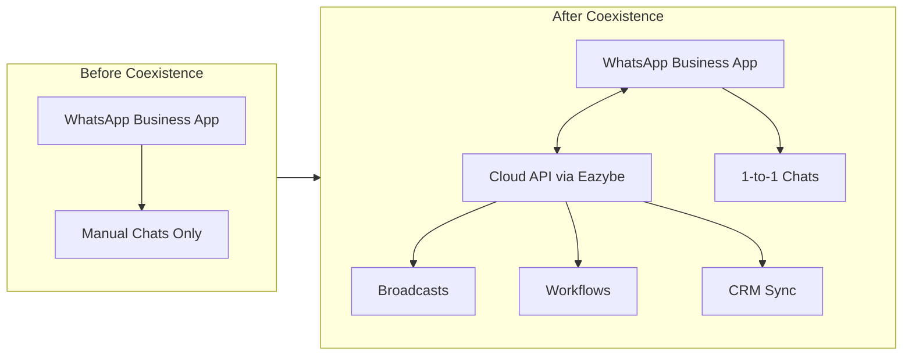
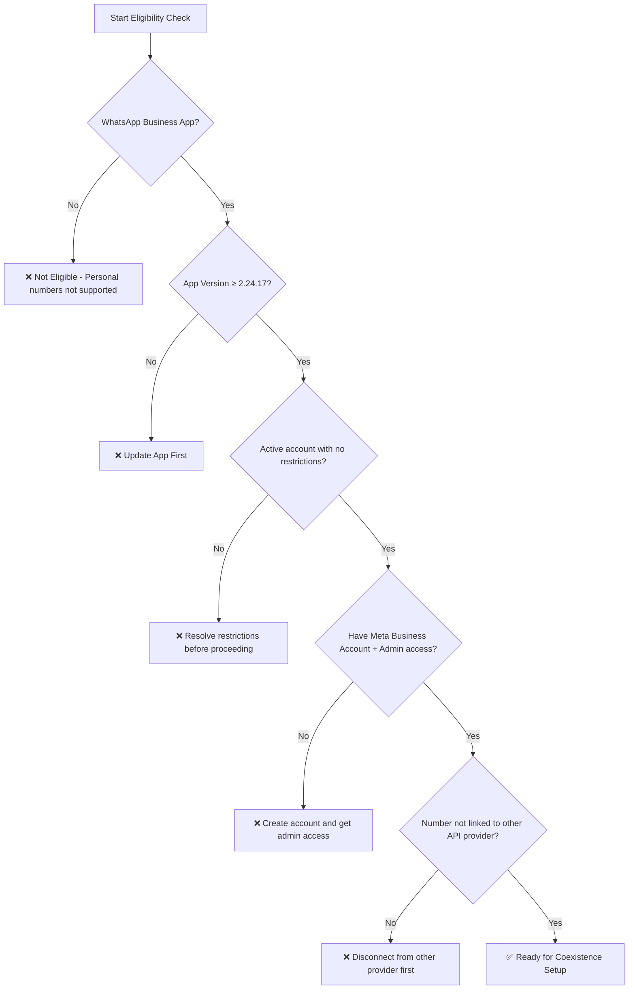
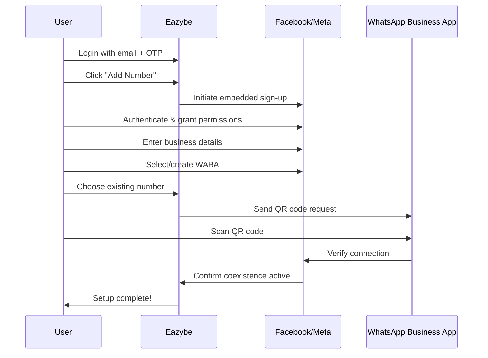
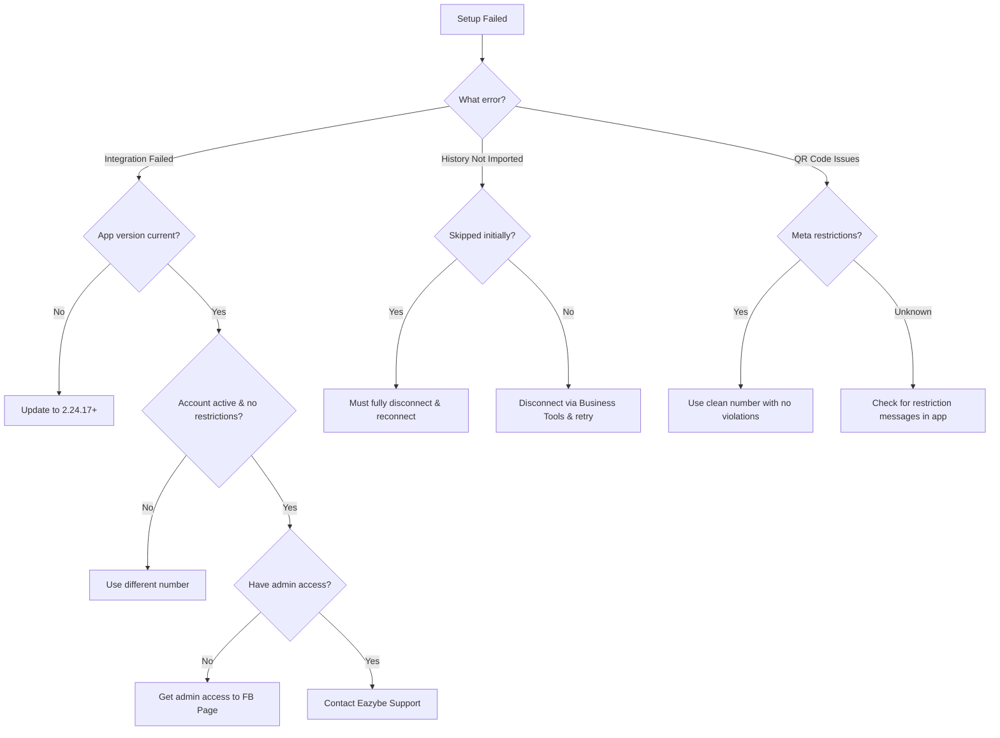

<Info>
**What is Coexistence?** A Meta-provided solution that connects your active WhatsApp Business App phone number to the WhatsApp Cloud API — without losing chats, contacts, or requiring re-registration.
</Info>

## How Coexistence Works

<CardGroup cols={2}>
  <Card title="Keep Your Number" icon="hashtag">
    Use the same phone number across WhatsApp Business App and Cloud API
  </Card>
  <Card title="Real-Time Sync" icon="rotate">
    Messages sent/received through the app appear in the API inbox and vice versa
  </Card>
  <Card title="Preserve Everything" icon="shield-check">
    Keep your chat history, contacts, and verified badge intact
  </Card>
  <Card title="Hybrid Workflow" icon="code-merge">
    Manual app chats + automated broadcasts and workflows via API
  </Card>
</CardGroup>

---

## Prerequisites Checklist

<Warning>
Failing to meet these requirements will cause onboarding to fail. Verify each item before starting.
</Warning>

<AccordionGroup>
  <Accordion title="WhatsApp Business Account Requirements" icon="whatsapp">
    | Requirement | Details |
    |-------------|---------|
    | **Account Type** | Must be WhatsApp Business App — personal WhatsApp numbers are **not supported** |
    | **App Version** | Version **2.24.17 or newer** required |
    | **Account Health** | No Meta restrictions or policy violations |
    | **Activity Level** | Regular, genuine 1:1 conversations for at least **3–7 days** before and after setup |
  </Accordion>

  <Accordion title="Meta Business Requirements" icon="meta">
    | Requirement | Details |
    |-------------|---------|
    | **Facebook Business Page** | You must have an existing page |
    | **Admin Access** | You must have admin permissions on the page |
    | **Meta Business Account** | Active account required |
    | **Number Eligibility** | Number must not be linked to another WhatsApp API provider |
  </Accordion>

  <Accordion title="Regional Restrictions" icon="globe">
    <Note>
    Numbers from **Nigeria** and **South Africa** are currently not supported due to Meta regulations. This is subject to change.
    </Note>
  </Accordion>
</AccordionGroup>

### Quick Eligibility Check

---

## Step-by-Step Setup Guide

<Steps>
  <Step title="Login to Eazybe">
    Enter your email and log in to your account.

    <Frame>
      
    </Frame>

    Enter the OTP sent to your Gmail inbox to verify your identity.

    <Frame>
      
    </Frame>
  </Step>

  <Step title="Start Embedded Sign-Up">
    After OTP verification, you'll reach the Get Started page. Click **Add Number** to begin the embedded sign-up process.

    <Frame>
      
    </Frame>
  </Step>

  <Step title="Authenticate with Facebook">
    A login page will appear. Enter your Facebook credentials or click **Continue as [Your Name]** if your session is saved.

    <Frame>
      
    </Frame>

    <Note>
    This popup is managed by Facebook. Eazybe does not see or store your personal Facebook login details.
    </Note>

    Click **Continue** on the permissions page to proceed.

    <Frame>
      
    </Frame>
  </Step>

  <Step title="Enter Business Details">
    Fill in your business information accurately in the provided fields.

    <Frame>
      
    </Frame>
  </Step>

  <Step title="Select or Create Business Portfolio">
    Choose an existing business portfolio or create a new one.

    <Frame>
      
    </Frame>

    <Warning>
    **Critical:** Always create a **NEW WABA account** for coexistence to ensure fresh usage and healthy account flow.
    </Warning>
  </Step>

  <Step title="Choose Your Onboarding Method">
    You'll see two options:

    <CardGroup cols={2}>
      <Card title="Connect Existing Number" icon="link">
        Connect your existing WhatsApp Business number to the Cloud API
      </Card>
      <Card title="Start with New Number" icon="plus">
        Begin with a fresh WhatsApp contact number
      </Card>
    </CardGroup>

    **Constraints for your number:**
    - Must not be currently linked to any other partner
    - Must be a new or existing WhatsApp Business number
    - Must not be blocked by Meta
  </Step>

  <Step title="Enter Phone Number">
    Select your country code and enter your number, then click **Next**.

    <Frame>
      
    </Frame>
  </Step>

  <Step title="Scan QR Code">
    A WhatsApp message will be sent to your number. Click **Scan QR Code** to scan the QR displayed on screen.

    <Frame>
      
    </Frame>

    <Tabs>
      <Tab title="Option 1: Via WhatsApp Message">
        Open WhatsApp Business app → Find the message from **Facebook Business** → Tap **Connect to Business Platform** → Click **Scan QR Code**
      </Tab>
      <Tab title="Option 2: Enter Access Code">
        Enter the access code displayed on screen directly into your mobile app
      </Tab>
    </Tabs>
  </Step>

  <Step title="Import Chat History (Optional)">
    After scanning, choose your import preferences:

    | Data Type | Import Option |
    |-----------|---------------|
    | **Contacts** | Automatically imported (all contacts) |
    | **1:1 Chats** | Up to 6 months of history |
    | **Media** | Up to 2 weeks |
    | **Group Chats** | Not imported |

    <Frame>
      
    </Frame>

    <Info>
    If you skip history import initially and later want to import, you must fully disconnect and reconnect. Choose wisely.
    </Info>
  </Step>

  <Step title="Complete Connection">
    Wait for the account connection process to complete.

    <Frame>
      
    </Frame>

    Click **Finish** when complete. Your Coexistence setup is now active.

    <Frame>
      
    </Frame>
  </Step>
</Steps>

---

## Onboarding Flow Overview

---

## Troubleshooting

<AccordionGroup>
  <Accordion title="Integration Failed" icon="circle-exclamation">
    **Common Causes:**
    - WhatsApp app version is outdated (below 2.24.17)
    - Number has been inactive for extended period
    - Meta restrictions on the account
    - No Facebook Page admin access

    **Solution:**
    <Steps>
      <Step title="Verify App Version">
        Update WhatsApp Business App to version 2.24.17 or newer
      </Step>
      <Step title="Check Account Status">
        Ensure no Meta restrictions or policy violations exist
      </Step>
      <Step title="Verify Admin Access">
        Confirm you have admin access to your Facebook Business Page
      </Step>
      <Step title="Use Alternative Number">
        If issues persist, try a different number with active WhatsApp Business usage and no past violations
      </Step>
    </Steps>
  </Accordion>

  <Accordion title="Chat History Did Not Import" icon="clock-rotate-left">
    **If chat import fails:**

    <Steps>
      <Step title="Open WhatsApp Business App">
        Navigate to the app on your phone
      </Step>
      <Step title="Access Business Tools">
        Go to: Settings → Business Tools → WhatsApp Business Platform
      </Step>
      <Step title="Disconnect">
        Tap **Disconnect** to unlink the current connection
      </Step>
      <Step title="Restart Onboarding">
        Begin the Coexistence onboarding process again
      </Step>
    </Steps>

    <Warning>
    If you manually skipped history import during initial setup and selected the wrong option, old chats may not be recoverable. A full disconnect and reconnect is required.
    </Warning>
  </Accordion>

  <Accordion title="Number Has Meta Restrictions" icon="ban">
    **Symptoms:**
    - Coexistence onboarding fails instantly
    - QR code doesn't complete verification
    - No "Connect to Business Platform" message appears in app

    **Solution:**
    Use a different number that has:
    - Zero policy violations
    - Frequent legitimate WhatsApp Business activity
    - No previous restrictions or bans

    <Note>
    Meta restrictions cannot be bypassed. A clean number is required for successful Coexistence setup.
    </Note>
  </Accordion>
</AccordionGroup>

### Troubleshooting Decision Tree

---

## Frequently Asked Questions

<AccordionGroup>
  <Accordion title="Can I use a personal WhatsApp number?">
    **No.** Only WhatsApp Business App numbers are supported. Personal WhatsApp numbers cannot be connected via Coexistence.
  </Accordion>

  <Accordion title="Will my chats stay on my phone app?">
    **Yes.** Nothing is deleted from your WhatsApp Business App. Your existing chats, contacts, and media remain intact on your device.
  </Accordion>

  <Accordion title="Can I still use the WhatsApp Business App after Coexistence?">
    **Yes.** You continue using it normally for 1-to-1 conversations while the Cloud API handles automation, broadcasts, and workflows.
  </Accordion>

  <Accordion title="What happens to my verified badge?">
    Your verified badge (green checkmark) is preserved through the Coexistence process. No re-verification is required.
  </Accordion>

  <Accordion title="Is there a cooldown period if I disconnect?">
    Yes. If you disconnect and want to reconnect, a cooldown period of **1–2 months** may be required before re-enabling Coexistence on the same number.
  </Accordion>
</AccordionGroup>

---

## Best Practices After Onboarding

<CardGroup cols={3}>
  <Card title="Keep App Open" icon="mobile-screen">
    Maintain sync by keeping your WhatsApp Business app open during initial setup
  </Card>
  <Card title="Maintain Activity" icon="comments">
    Continue genuine 1:1 conversations to keep your account healthy
  </Card>
  <Card title="Monitor Messages" icon="chart-line">
    Use Eazybe dashboard to track both manual and automated conversations
  </Card>
</CardGroup>

<Tip>
**Pro Tip:** Use the WhatsApp Business App for personal, relationship-building conversations while leveraging Eazybe's Cloud API for scalable broadcasts, chatbots, and CRM workflows.
</Tip>

---

## What's Next?

<CardGroup cols={2}>
  <Card title="Set Up Broadcasts" icon="bullhorn" href="/messaging/broadcasts/creating-broadcast">
    Send template messages to multiple contacts at scale
  </Card>
  <Card title="Configure Chatbots" icon="robot" href="/ai-agents/chatbots/overview">
    Automate responses with AI-powered chatbots
  </Card>
  <Card title="Connect Your CRM" icon="database" href="/integrations/crm/overview">
    Sync conversations with HubSpot, Zoho, or Salesforce
  </Card>
  <Card title="Team Inbox Setup" icon="users" href="/team-inbox/overview">
    Enable collaborative chat management for your team
  </Card>
</CardGroup>

---

## Gap Analysis & Edge Cases

<Warning>
**Not Covered in This Guide:**
- Migrating from another API provider to Eazybe (requires disconnection from previous provider first)
- Business verification process for Meta Business Manager
- Template message approval workflow
- Handling numbers that were previously banned and restored
</Warning>

<Info>
For edge cases or scenarios not covered here, contact [Eazybe Support](mailto:support@eazybe.com) or your dedicated account manager.
</Info>
