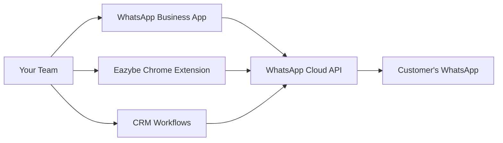

## What is Coexistence?

Coexistence is a unique feature that allows you to use the same WhatsApp number with both:
- **WhatsApp Business App** - For manual, personal conversations
- **WhatsApp Cloud API** - For automated broadcasts and workflows

This means you don't have to choose between the convenience of the mobile app and the power of the API.

<Info>
  Coexistence is exclusive to Eazybe and solves one of the biggest pain points when adopting WhatsApp Business API.
</Info>

## Benefits of Coexistence

<CardGroup cols={2}>
  <Card title="Keep Your Mobile App" icon="mobile">
    Continue using WhatsApp Business App for 1-on-1 chats with the familiar interface.
  </Card>
  <Card title="Unlock API Power" icon="bolt">
    Send broadcasts, automate workflows, and use templates via the API.
  </Card>
  <Card title="Preserve Chat History" icon="clock-rotate-left">
    No data loss when enabling API - all existing conversations remain accessible.
  </Card>
  <Card title="Real-Time Sync" icon="rotate">
    Messages sent via app appear in API inbox and vice versa.
  </Card>
</CardGroup>

## How It Works

**Sync Flow:**
1. Messages sent via Business App sync to the API inbox
2. API-sent messages appear in the Business App
3. Eazybe monitors both channels in Revenue Inbox
4. CRM receives all conversations regardless of source

## Prerequisites

Before enabling Coexistence:

<Check>WhatsApp Business App installed (not personal WhatsApp)</Check>
<Check>App updated to the latest version</Check>
<Check>Active Eazybe subscription</Check>
<Check>Meta Business Account (created during setup)</Check>
<Check>Phone number not recently disconnected from API</Check>

<Warning>
  Coexistence only works with WhatsApp Business App, not personal WhatsApp. If you're using personal WhatsApp, first migrate to Business App.
</Warning>

## Setting Up Coexistence

<Steps>
  <Step title="Access Eazybe Workspace">
    Log in to your Eazybe workspace at [workspace.eazybe.com](https://workspace.eazybe.com)
    
    Navigate to **Settings** → **WhatsApp Business API**
  </Step>
  
  <Step title="Start Coexistence Setup">
    Click **Add Number** → **Enable Coexistence**
    
    You'll see instructions specific to your setup.
  </Step>
  
  <Step title="Connect Meta Business Account">
    Follow the embedded signup flow:
    1. Log in to your Facebook account
    2. Create or select a Meta Business Portfolio
    3. Verify your business information
    4. Accept WhatsApp Business Terms
  </Step>
  
  <Step title="Link Your WhatsApp Business App">
    **Option 1: QR Code Scan**
    - Open WhatsApp Business on your phone
    - You'll receive a message from "Facebook Business"
    - Click **Scan QR Code** in that message
    - Scan the QR displayed in Eazybe
    
    **Option 2: Access Code**
    - Enter the 6-digit code shown on screen
    - Input it in the WhatsApp Business app when prompted
  </Step>
  
  <Step title="Sync Chat History">
    Meta will prompt you to sync message history:
    - Keep WhatsApp Business app open
    - Up to 6 months of chat history will import
    - This may take a few minutes depending on volume
  </Step>
  
  <Step title="Confirm Connection">
    Once complete:
    - Your number shows as "Connected via Coexistence" in Eazybe
    - The WhatsApp Business app remains fully functional
    - API features are now available
  </Step>
</Steps>

## Using Coexistence Daily

### What Goes Through the App

Use the WhatsApp Business App for:
- Personal, high-touch conversations
- Voice and video calls
- Viewing shared media
- Using native WhatsApp features

### What Goes Through the API

Use the API (via Eazybe) for:
- Broadcast campaigns to large lists
- Automated workflow messages
- Template-based notifications
- Bulk follow-ups

### Where to Monitor

| Channel | View In |
|---------|---------|
| All conversations | Eazybe Revenue Inbox |
| Manual chats | WhatsApp Business App + Eazybe |
| Broadcast replies | Eazybe Revenue Inbox |
| API-sent messages | Eazybe + WhatsApp Business App |

## Coexistence vs. API-Only

| Aspect | Coexistence | API-Only |
|--------|-------------|----------|
| Mobile app access | ✅ Yes | ❌ No |
| Voice/video calls | ✅ Yes | ❌ No |
| Manual messaging | ✅ Easy | ⚠️ Via Eazybe only |
| Broadcasts | ✅ Yes | ✅ Yes |
| Workflow automation | ✅ Yes | ✅ Yes |
| Chat history | ✅ Preserved | ❌ Fresh start |
| Team transition | ✅ Smooth | ⚠️ Requires training |

## Limitations

<Warning>
  **Coexistence Limitations:**
  - Requires WhatsApp Business App (not personal)
  - Number must not have been recently disconnected from API
  - Some advanced API features may have slight delays
  - Both app and API share the same quality rating
</Warning>

## Troubleshooting

<AccordionGroup>
  <Accordion title="QR code won't scan">
    - Ensure you're using WhatsApp Business App, not personal
    - Update the app to the latest version
    - Check that your camera permissions are enabled
    - Try the access code method instead
  </Accordion>
  
  <Accordion title="Chat history not syncing">
    - Keep the WhatsApp Business app open during sync
    - Ensure stable internet connection
    - Wait up to 10 minutes for large histories
    - Contact support if sync fails after 15 minutes
  </Accordion>
  
  <Accordion title="Messages not appearing in both places">
    - Allow 1-2 minutes for sync between app and API
    - Check your internet connection
    - Restart the WhatsApp Business app
    - Verify connection status in Eazybe workspace
  </Accordion>
  
  <Accordion title="Number shows as disconnected">
    - Open WhatsApp Business app to restore connection
    - Re-scan QR code if prompted
    - Check if number was used elsewhere
    - Contact support if issue persists
  </Accordion>
  
  <Accordion title="Cooldown period error">
    If your number was previously connected to API and disconnected, there may be a 1-2 month cooldown before you can enable Coexistence again. This is a Meta restriction.
  </Accordion>
</AccordionGroup>

## FAQ

<AccordionGroup>
  <Accordion title="Is Coexistence free?">
    Coexistence is included with your Eazybe subscription. However, API message fees (charged by Meta) apply when sending via the API.
  </Accordion>
  
  <Accordion title="Can I disable Coexistence later?">
    Yes, you can unlink the API connection while keeping the Business App. Go to Eazybe Workspace → Settings → WhatsApp Business API → Disconnect.
  </Accordion>
  
  <Accordion title="Will my customers know which channel I'm using?">
    No. From your customer's perspective, all messages come from the same WhatsApp number. They won't see any difference.
  </Accordion>
  
  <Accordion title="Can multiple team members use Coexistence?">
    The WhatsApp Business App is limited to one device. However, the API side can be accessed by multiple team members through Eazybe's Revenue Inbox.
  </Accordion>
</AccordionGroup>

## Next Steps

<CardGroup cols={2}>
  <Card
    title="Create Message Templates"
    icon="file-lines"
    href="/waba/templates/creating-templates"
  >
    Set up templates for API messaging
  </Card>
  <Card
    title="Send Your First Broadcast"
    icon="tower-broadcast"
    href="/waba/broadcasting/create-campaign"
  >
    Launch a campaign using Coexistence
  </Card>
</CardGroup>
