<Info>
**Setup Time**: 20 minutes | **Difficulty**: Medium | **HubSpot Plan**: Professional+  
**Requires**: WhatsApp Business API (WABA)
</Info>

## The Problem

Your team manually sends the same follow-up messages over and over:
- "Thanks for booking a demo!"
- "Following up on the proposal..."
- "Your order has shipped!"

It's time-consuming and inconsistent.

## The Solution

HubSpot workflows automatically trigger WhatsApp messages when events occur.

<Frame caption="HubSpot workflow sending WhatsApp message">
  
</Frame>

## Prerequisites

<Warning>
**WhatsApp Business API Required**

Automated messaging requires WABA. Without it, you can still:
- Get HubSpot task notifications to send manually
- Use Eazybe quick replies for faster responses
</Warning>

Before starting:
1. ✅ WABA connected to Eazybe
2. ✅ Message templates approved by Meta
3. ✅ HubSpot Professional or Enterprise plan
4. ✅ Workflow permissions in HubSpot

## Step-by-Step Setup

### Part 1: Create Message Template

<Steps>
  <Step title="Go to Templates">
    In Eazybe, navigate to **WABA** → **Message Templates**
    
    <Frame>
      
    </Frame>
  </Step>
  
  <Step title="Create New Template">
    Click **+ New Template**
    
    - **Name**: `demo_followup` (lowercase, underscores only)
    - **Category**: Utility or Marketing
    - **Language**: English (or your language)
    
    <Frame>
      
    </Frame>
  </Step>
  
  <Step title="Write Template with Variables">
    Use variables that will map to HubSpot properties:
    
    ```
    Hi {{1}}! 👋
    
    Thanks for booking a demo with {{2}}. Looking forward to showing you how Eazybe can help {{3}} manage WhatsApp conversations.
    
    See you on {{4}} at {{5}}.
    
    Reply to this message if you have any questions before then!
    ```
    
    Variable mapping:
    - `{{1}}` → Contact First Name
    - `{{2}}` → Meeting Owner Name
    - `{{3}}` → Company Name
    - `{{4}}` → Meeting Date
    - `{{5}}` → Meeting Time
    
    <Frame>
      
    </Frame>
  </Step>
  
  <Step title="Submit for Approval">
    Click **Submit**. Meta reviews within 24-48 hours.
    
    <Frame>
      
    </Frame>
  </Step>
</Steps>

### Part 2: Create HubSpot Workflow

<Steps>
  <Step title="Go to Workflows">
    In HubSpot, navigate to **Automation** → **Workflows**
    
    <Frame>
      
    </Frame>
  </Step>
  
  <Step title="Create New Workflow">
    Click **Create workflow** → **From scratch**
    
    Choose object type:
    - **Contact-based** - For individual follow-ups
    - **Deal-based** - For deal stage changes
    - **Ticket-based** - For support workflows
    
    <Frame>
      
    </Frame>
  </Step>
  
  <Step title="Set Enrollment Trigger">
    Choose what triggers the workflow:
    
    **Example: Demo Booked**
    ```
    When: Meeting is created
    Filter: Meeting type = "Demo"
    ```
    
    <Frame>
      
    </Frame>
    
    **Other common triggers:**
    - Deal stage changed
    - Form submitted
    - Property changed
    - List membership
  </Step>
  
  <Step title="Add Eazybe Action">
    Click **+** → Search "Eazybe" → Select **Send WhatsApp Message**
    
    <Frame>
      
    </Frame>
  </Step>
  
  <Step title="Configure WhatsApp Action">
    In the Eazybe action panel:
    
    1. **Select Template**: Choose your approved template
    2. **Map Variables**: Connect HubSpot properties to template variables
    3. **Select Sender**: Choose which WABA number sends the message
    
    <Frame>
      
    </Frame>
    
    **Variable Mapping:**
    
    | Template Variable | HubSpot Property |
    |-------------------|------------------|
    | {1} | Contact: First name |
    | {2} | Contact owner: Name |
    | {3} | Company: Name |
    | {4} | Meeting: Start date |
    | {5} | Meeting: Start time |
  </Step>
  
  <Step title="Add Delay (Optional)">
    Add a delay before sending:
    
    - **Immediately** - Send right away
    - **Delay** - Wait X hours/days
    - **Specific time** - Send at set time
    
    <Frame>
      
    </Frame>
  </Step>
  
  <Step title="Review and Activate">
    1. Click **Review** to check workflow
    2. Test with a sample contact
    3. Click **Turn on**
    
    <Frame>
      
    </Frame>
  </Step>
</Steps>

## Video Walkthrough

<Frame>
  <iframe 
    src="https://www.loom.com/embed/your-hubspot-workflow-video" 
    width="100%" 
    height="400" 
    frameborder="0" 
    allowfullscreen>
  </iframe>
</Frame>

## Common Workflow Examples

### 1. Demo Confirmation


**Template:**
> Hi {1}, confirming your demo tomorrow at {2}. Reply YES to confirm or let me know if you need to reschedule.

### 2. Proposal Follow-up

```mermaid
flowchart LR
    A[Deal → Proposal Sent] --> B[Wait 3 days]
    B --> C{Deal stage changed?}
    C -->|No| D[Send Follow-up WhatsApp]
    C -->|Yes| E[End]
```



**Template:**
> Hi {1}, following up on the proposal I sent for {2}. Happy to answer any questions or walk through the pricing together.

### 3. Won Deal Thank You

```mermaid
flowchart LR
    A[Deal → Closed Won] --> B[Send Thank You WhatsApp]
    B --> C[Create onboarding task]
```



**Template:**
> Great news {1}! 🎉 Welcome to the family. Our onboarding team will reach out within 24 hours to get you started.

## What It Looks Like

### In HubSpot Workflow History

<Frame caption="WhatsApp action in workflow history">
  
</Frame>

### On Contact Timeline

<Frame caption="Automated WhatsApp on contact timeline">
  
</Frame>

## Best Practices

<AccordionGroup>
  <Accordion title="Always add fallback values">
    If a HubSpot property is empty, the variable shows blank. Add fallbacks:
    - Use HubSpot's "default value" option
    - Or add if/then branch to skip contacts with missing data
  </Accordion>
  
  <Accordion title="Don't over-automate">
    Limit to 2-3 automated messages per contact. After that, human touch matters more.
  </Accordion>
  
  <Accordion title="Test before activating">
    Use HubSpot's "Test" feature with a sample contact (yourself) before going live.
  </Accordion>
  
  <Accordion title="Monitor delivery rates">
    Check Eazybe analytics for failed messages. Common issues: invalid numbers, opted-out contacts.
  </Accordion>
</AccordionGroup>

## Troubleshooting

<AccordionGroup>
  <Accordion title="Workflow not triggering?">
    1. Check enrollment criteria is met
    2. Verify contact isn't already enrolled (check re-enrollment settings)
    3. Check workflow is active
    4. Review workflow history for errors
  </Accordion>
  
  <Accordion title="WhatsApp not sending?">
    1. Verify WABA is connected
    2. Check template is approved (not pending/rejected)
    3. Ensure contact has valid phone number
    4. Check Eazybe action configuration
  </Accordion>
  
  <Accordion title="Variables showing blank?">
    HubSpot property is empty for that contact. Either:
    - Add default value in variable mapping
    - Add workflow branch to check property exists first
  </Accordion>
  
  <Accordion title="Wrong number receiving message?">
    Check which phone property is mapped. HubSpot contacts can have multiple phone fields.
  </Accordion>
</AccordionGroup>

## What's Next?

<CardGroup cols={2}>
  <Card title="Deal Stage Alerts" icon="bell" href="/integrations/hubspot/playbooks/deal-alerts">
    Notify on deal movements
  </Card>
  <Card title="Broadcast from Lists" icon="tower-broadcast" href="/integrations/hubspot/playbooks/broadcast-lists">
    Send campaigns to HubSpot lists
  </Card>
</CardGroup>
