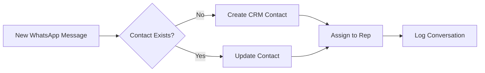

## Overview

Stop manually copying phone numbers from WhatsApp to your CRM. This playbook shows you how to automatically create contacts in your CRM whenever a new WhatsApp conversation starts.

<Info>
**Setup Time**: 10 minutes  
**Difficulty**: Easy  
**Works With**: HubSpot, Zoho, Salesforce, Pipedrive
</Info>

## The Problem

Your sales team talks to dozens of prospects on WhatsApp daily, but:
- Contact info never makes it to the CRM
- No visibility into who's talking to whom
- Leads fall through the cracks
- Managers can't track pipeline

<Frame>
  
</Frame>

## The Solution

Eazybe automatically syncs WhatsApp contacts to your CRM:

<Frame>
  
</Frame>

## Step-by-Step Setup

<Steps>
  <Step title="Connect Your CRM">
    Go to **Settings** → **Integrations** → Select your CRM → Click **Connect**
    
    <Frame>
      
    </Frame>
  </Step>
  
  <Step title="Enable Auto-Sync">
    Toggle **Auto-create contacts** to ON
    
    Choose when to create contacts:
    - **Every new chat** - Creates contact for any new conversation
    - **Manual only** - You choose which contacts to sync
    
    <Frame>
      
    </Frame>
  </Step>
  
  <Step title="Configure Field Mapping">
    Map WhatsApp fields to CRM fields:
    
    | WhatsApp | CRM Field |
    |----------|-----------|
    | Phone Number | Phone |
    | Profile Name | First Name |
    | First Message | Lead Source Notes |
    
    <Frame>
      
    </Frame>
  </Step>
  
  <Step title="Set Default Properties">
    Auto-assign properties to new contacts:
    - **Lead Source**: WhatsApp
    - **Owner**: The rep who received the message
    - **Lifecycle Stage**: Lead
  </Step>
</Steps>

## Video Walkthrough

<Frame>
  <iframe 
    src="https://www.loom.com/embed/your-video-id" 
    width="100%" 
    height="400" 
    frameborder="0" 
    allowfullscreen>
  </iframe>
</Frame>

## How It Works

## Best Practices

<AccordionGroup>
  <Accordion title="Avoid duplicates">
    Eazybe matches contacts by phone number. Ensure your CRM phone format is consistent (E.164 format recommended: +919876543210)
  </Accordion>
  
  <Accordion title="Handle existing contacts">
    If a contact already exists, Eazybe links the WhatsApp conversation to it instead of creating a duplicate.
  </Accordion>
  
  <Accordion title="Team visibility">
    Enable **Chat Backup** so all conversations are visible in the CRM timeline, even if a rep leaves.
  </Accordion>
</AccordionGroup>

## Troubleshooting

<AccordionGroup>
  <Accordion title="Contacts not syncing?">
    1. Check CRM connection status in Settings
    2. Verify auto-sync is enabled
    3. Check if you have CRM write permissions
  </Accordion>
  
  <Accordion title="Wrong data in CRM?">
    Review field mapping settings. WhatsApp profile names may include emojis or nicknames.
  </Accordion>
</AccordionGroup>

## What's Next?

<CardGroup cols={2}>
  <Card title="Chat Backup" icon="cloud-arrow-up" href="/integrations/playbooks/chat-backup">
    Log conversations to CRM timeline
  </Card>
  <Card title="Sales Follow-up" icon="clock" href="/integrations/playbooks/sales-followup">
    Automate follow-up messages
  </Card>
</CardGroup>
