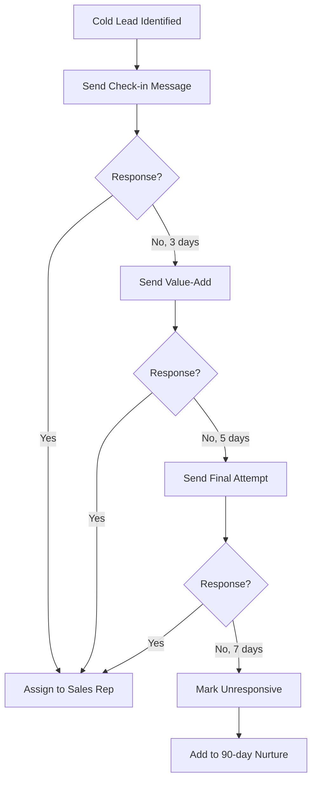

## Overview

Leads go cold. It happens. But many "dead" leads just need a nudge. This playbook shows you how to systematically re-engage cold leads via WhatsApp.

<Info>
**Setup Time**: 25 minutes  
**Difficulty**: Medium  
**Works With**: HubSpot, Zoho (WABA recommended for automation)
</Info>

## The Problem

Your CRM is full of leads that went silent:
- Demo booked but never showed
- Proposal sent but no response
- Initial interest but ghosted
- Lost to competitor (but deals change)

These leads cost money to acquire. Don't give up on them.

## The Solution

Automated WhatsApp re-engagement sequences:

<Frame>
  
</Frame>

## Identifying Cold Leads

### Define "Cold"

| Lead Type | Cold Definition |
|-----------|-----------------|
| **New leads** | No response in 7 days |
| **Demo scheduled** | No-show or no follow-up in 14 days |
| **Proposal sent** | No response in 21 days |
| **Lost deals** | Lost 30-90 days ago |

### Create a Cold Lead List

<Tabs>
  <Tab title="HubSpot">
    Create active list with filters:
    
    ```
    Last Activity Date is more than 30 days ago
    AND Lifecycle Stage is Lead or MQL
    AND Lead Status is not Unqualified
    AND Has WhatsApp Number
    ```
    
    <Frame>
      
    </Frame>
  </Tab>
  
  <Tab title="Zoho">
    Create view with criteria:
    
    ```
    Last Activity Time < 30 days ago
    AND Lead Status != Converted, Junk
    AND Phone is not empty
    ```
  </Tab>
</Tabs>

## Recovery Message Templates

### Template 1: Soft Check-in

**Best for**: Leads who showed initial interest

```
Hi {{1}}! 👋

It's {{2}} from {{3}}. We chatted a while back about {{4}}.

Just checking in - is this still something you're exploring?

No pressure either way, just wanted to make sure I didn't drop the ball on my end.
```

**Response rate**: ~25%

### Template 2: Value-Add

**Best for**: Leads who went cold after demo

```
Hi {{1}},

Hope you're doing well! I came across this {{resource_type}} that made me think of our conversation about {{topic}}.

{{resource_link}}

Thought you might find it useful regardless of where you are in your evaluation.

Happy to chat if any questions come up!
```

**Response rate**: ~20%

### Template 3: FOMO/Urgency

**Best for**: Lost deals, price-sensitive leads

```
Hi {{1}},

Quick heads up - we're running a special offer this month that I thought might be relevant given what you were looking for.

{{offer_details}}

Would you be open to a quick 10-min call to see if it makes sense now?
```

**Response rate**: ~15%

### Template 4: Feedback Request

**Best for**: Complete ghosts, getting closure

```
Hi {{1}},

I noticed we lost touch after {{last_interaction}}. 

Totally understand if the timing wasn't right or you went another direction - just wanted to quickly ask what could we have done better?

Your feedback would really help us improve. Thanks! 🙏
```

**Response rate**: ~30% (people love giving feedback)

## Automation Sequence

<Steps>
  <Step title="Day 1: Soft Check-in">
    Send Template 1 to all cold leads
    
    Wait for response (3 days)
  </Step>
  
  <Step title="Day 4: Value-Add">
    No response? Send Template 2 with relevant content
    
    Wait (5 days)
  </Step>
  
  <Step title="Day 9: Final Attempt">
    Still no response? Send Template 3 or 4
    
    Wait (7 days)
  </Step>
  
  <Step title="Day 16: Close Loop">
    No response after 3 attempts?
    - Mark as "Unresponsive"
    - Remove from active outreach
    - Add to 90-day nurture list
  </Step>
</Steps>



## Video Walkthrough

<Frame>
  <iframe 
    src="https://www.loom.com/embed/your-video-id" 
    width="100%" 
    height="400" 
    frameborder="0" 
    allowfullscreen>
  </iframe>
</Frame>

## Setting Up the Workflow

<Tabs>
  <Tab title="HubSpot Workflow">
    <Steps>
      <Step title="Create Workflow">
        **Automation** → **Workflows** → Contact-based
        
        Enrollment: Contact is added to "Cold Leads" list
      </Step>
      
      <Step title="Add Sequence">
        ```
        1. Send WhatsApp (Template 1)
        2. Delay 3 days
        3. If/then: Check for reply
           - Yes: End workflow, notify rep
           - No: Continue
        4. Send WhatsApp (Template 2)
        5. Delay 5 days
        6. If/then: Check for reply
           - Yes: End workflow, notify rep
           - No: Continue
        7. Send WhatsApp (Template 3)
        8. Delay 7 days
        9. If/then: Check for reply
           - Yes: End workflow, notify rep
           - No: Set property "Recovery Status" = "Unresponsive"
        ```
      </Step>
      
      <Step title="Activate">
        Review settings, turn on workflow
      </Step>
    </Steps>
  </Tab>
  
  <Tab title="Manual Approach">
    No automation? Use labels:
    
    1. **Label cold leads** as "Recovery - Day 1"
    2. **Send first message** to all Day 1 leads
    3. **Move responders** out of recovery
    4. **Relabel non-responders** as "Recovery - Day 4"
    5. **Repeat** until sequence complete
  </Tab>
</Tabs>

## Tracking Results

| Metric | How to Calculate | Good Result |
|--------|------------------|-------------|
| **Recovery Rate** | Responses / Cold Leads Contacted | > 15% |
| **Conversion Rate** | Recovered Leads / Responses | > 30% |
| **ROI** | Revenue from Recovered / Campaign Cost | > 5x |

## Best Practices

<AccordionGroup>
  <Accordion title="Personalize based on history">
    Reference specific past interactions. "After our demo of the analytics feature..." beats "After our chat..."
  </Accordion>
  
  <Accordion title="Don't be pushy">
    Recovery is about re-opening conversation, not hard selling. Keep it casual and helpful.
  </Accordion>
  
  <Accordion title="Time your outreach">
    Send during business hours. Tuesday-Thursday typically works best.
  </Accordion>
  
  <Accordion title="Know when to stop">
    After 3 attempts with no response, stop. Continuing looks desperate and hurts your brand.
  </Accordion>
  
  <Accordion title="Track and learn">
    Which templates get best response? Which lead types recover? Use data to improve.
  </Accordion>
</AccordionGroup>

## What Happens After Recovery?

When a lead responds:

1. **Immediate notification** to assigned rep
2. **Update CRM** - Change status to "Re-engaged"
3. **Rep follows up** within 1 hour
4. **Continue conversation** based on their response

## What's Next?

<CardGroup cols={2}>
  <Card title="Sales Follow-up" icon="clock" href="/integrations/playbooks/sales-followup">
    Keep deals moving with automation
  </Card>
  <Card title="Team Tracking" icon="chart-line" href="/integrations/playbooks/team-tracking">
    Monitor recovery campaign performance
  </Card>
</CardGroup>
