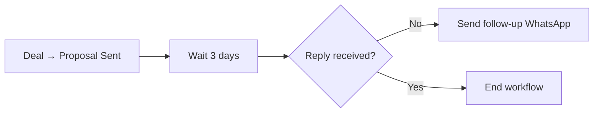
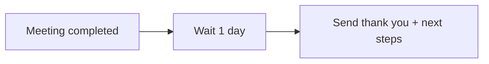
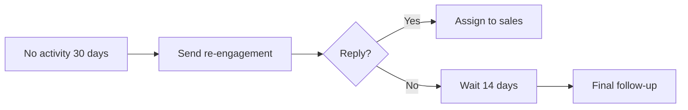

## Overview

Stop manually sending follow-up messages. This playbook shows you how to automatically send WhatsApp messages when deals move stages, tasks are due, or leads go cold.

<Info>
**Setup Time**: 20 minutes  
**Difficulty**: Medium  
**Works With**: HubSpot, Zoho (requires WABA for automated sending)
</Info>

## The Problem

Your sales team forgets to follow up:
- Deals stall because nobody reached out
- Leads go cold after initial contact
- Manual follow-ups are inconsistent
- Reps spend hours on repetitive messages

## The Solution

Automated WhatsApp messages triggered by CRM events:

<Frame>
  
</Frame>

## Prerequisites

<Warning>
**Automated messaging requires WhatsApp Business API (WABA)**

Without WABA, you can still:
- Get notifications to send manual follow-ups
- Use quick replies for faster responses
- Set reminders in your CRM
</Warning>

## Step-by-Step Setup

### Part 1: Create Message Templates

<Steps>
  <Step title="Go to Templates">
    Navigate to **WABA** → **Message Templates**
  </Step>
  
  <Step title="Create Template">
    Click **+ New Template** and choose category:
    
    | Category | Use For | Approval Time |
    |----------|---------|---------------|
    | **Utility** | Order updates, appointments | 24-48 hours |
    | **Marketing** | Promotions, follow-ups | 24-48 hours |
    
    <Frame>
      
    </Frame>
  </Step>
  
  <Step title="Add Variables">
    Use variables for personalization:
    
    ```
    Hi {{1}}, 
    
    Following up on our conversation about {{2}}. 
    Would you like to schedule a call this week?
    
    Best,
    {{3}}
    ```
    
    Variables map to CRM fields:
    - `{{1}}` → Contact First Name
    - `{{2}}` → Deal Name
    - `{{3}}` → Owner Name
  </Step>
  
  <Step title="Submit for Approval">
    Meta reviews templates within 24-48 hours. Approved templates show ✅ status.
  </Step>
</Steps>

### Part 2: Create CRM Workflow

<Tabs>
  <Tab title="HubSpot">
    <Steps>
      <Step title="Go to Workflows">
        Navigate to **Automation** → **Workflows** → **Create workflow**
      </Step>
      
      <Step title="Set Trigger">
        Choose trigger event:
        - Deal stage changed to "Proposal Sent"
        - Contact property changed
        - Form submitted
        - Manual enrollment
        
        <Frame>
          
        </Frame>
      </Step>
      
      <Step title="Add Eazybe Action">
        Click **+** → **Eazybe** → **Send WhatsApp Message**
        
        <Frame>
          
        </Frame>
      </Step>
      
      <Step title="Configure Message">
        - Select template
        - Map variables to HubSpot properties
        - Choose sender number
        
        <Frame>
          
        </Frame>
      </Step>
      
      <Step title="Activate Workflow">
        Review and click **Turn on**
      </Step>
    </Steps>
  </Tab>
  
  <Tab title="Zoho CRM">
    <Steps>
      <Step title="Go to Workflows">
        Navigate to **Setup** → **Automation** → **Workflow Rules**
      </Step>
      
      <Step title="Create Rule">
        Click **+ Create Rule** → Select module (Deals, Contacts, etc.)
      </Step>
      
      <Step title="Set Trigger">
        Choose:
        - On a record action (create/edit)
        - On a date/time
        - On a score change
      </Step>
      
      <Step title="Add Eazybe Action">
        **Instant Actions** → **Webhook** → Configure Eazybe endpoint
      </Step>
      
      <Step title="Activate">
        Save and activate the workflow
      </Step>
    </Steps>
  </Tab>
</Tabs>

## Video Walkthrough

<Frame>
  <iframe 
    src="https://www.loom.com/embed/your-video-id" 
    width="100%" 
    height="400" 
    frameborder="0" 
    allowfullscreen>
  </iframe>
</Frame>

## Common Workflow Examples

### 1. Deal Stage Follow-up



**Template:**
> Hi {{first_name}}, just checking in on the proposal I sent for {{deal_name}}. Any questions I can answer?

### 2. Post-Demo Follow-up



**Template:**
> Thanks for your time today, {{first_name}}! As discussed, here are the next steps: {{next_steps}}. Let me know if you have any questions.

### 3. Cold Lead Re-engagement



## Best Practices

<AccordionGroup>
  <Accordion title="Don't over-automate">
    Limit automated messages to 2-3 per lead. After that, human touch is essential.
  </Accordion>
  
  <Accordion title="Personalize with variables">
    Always include the contact's name and relevant context (deal name, product interest).
  </Accordion>
  
  <Accordion title="Respect timing">
    Add delays between messages. Don't send at odd hours. Use CRM timezone data.
  </Accordion>
  
  <Accordion title="Monitor and iterate">
    Track open rates and replies. Adjust templates based on performance.
  </Accordion>
</AccordionGroup>

## Troubleshooting

<AccordionGroup>
  <Accordion title="Messages not sending?">
    1. Verify WABA is connected
    2. Check template is approved
    3. Ensure contact has valid phone number
    4. Check workflow is active
  </Accordion>
  
  <Accordion title="Variables showing as blank?">
    The CRM field might be empty. Add fallback values:
    - Set default in template
    - Add workflow condition to check field exists
  </Accordion>
  
  <Accordion title="Wrong contact owner sending?">
    Configure workflow to use contact owner's WABA number, not a default sender.
  </Accordion>
</AccordionGroup>

## What's Next?

<CardGroup cols={2}>
  <Card title="Broadcast Campaigns" icon="tower-broadcast" href="/integrations/playbooks/broadcast-campaigns">
    Send bulk campaigns
  </Card>
  <Card title="Lead Recovery" icon="rotate-left" href="/integrations/playbooks/lead-recovery">
    Re-engage cold leads
  </Card>
</CardGroup>
