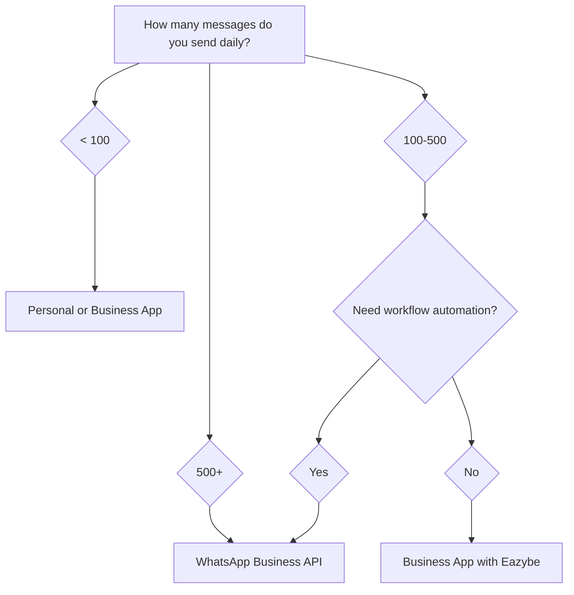

## Decision Framework

Use this guide to determine which WhatsApp account type best fits your business needs.

## Quick Decision Tree

## Feature Deep Dive

### Messaging Capabilities

| Capability | Personal | Business App | WABA |
|------------|----------|--------------|------|
| One-on-one messaging | ✅ Unlimited | ✅ Unlimited | ✅ Unlimited |
| Broadcast lists | 256 max | 256 max | Unlimited |
| Message templates | ❌ | ❌ | ✅ Required for outbound |
| Rich media | ✅ | ✅ | ✅ |
| Interactive buttons | ❌ | ❌ | ✅ |
| Product catalogs | ❌ | ✅ | ✅ |

### Business Features

| Feature | Personal | Business App | WABA |
|---------|----------|--------------|------|
| Business profile | ❌ | ✅ | ✅ |
| Business categories | ❌ | ✅ | ✅ |
| Business hours | ❌ | ✅ | ✅ |
| Away messages | ❌ | ✅ | ✅ Via automation |
| Quick replies | ❌ | ✅ | ✅ Via templates |
| Labels | ❌ | ✅ | ✅ Via Eazybe |
| Greeting messages | ❌ | ✅ | ✅ Via automation |

### Eazybe Integration

| Eazybe Feature | Personal | Business App | WABA |
|----------------|----------|--------------|------|
| Chrome extension | ✅ | ✅ | ✅ |
| CRM sync | ✅ | ✅ | ✅ |
| Chat backup | ✅ | ✅ | ✅ |
| Revenue Inbox | ✅ | ✅ | ✅ |
| Mini-CRM sidebar | ✅ | ✅ | ✅ |
| Quick replies | ✅ | ✅ | ✅ |
| Team monitoring | ✅ | ✅ | ✅ |
| CRM workflow triggers | ❌ | ❌ | ✅ |
| Broadcast campaigns | ❌ | ❌ | ✅ |
| API access | ❌ | ❌ | ✅ |

### Compliance & Verification

| Aspect | Personal | Business App | WABA |
|--------|----------|--------------|------|
| Meta verification | ❌ | ❌ | Optional |
| Green tick badge | ❌ | ❌ | Available |
| Business verification | ❌ | ❌ | Required |
| Template approval | ❌ | ❌ | Required |
| Message quality rating | ❌ | ❌ | Yes |

## Use Case Scenarios

### Scenario 1: Solo Real Estate Agent

**Situation:** Individual agent with 50-100 client conversations monthly

**Recommendation:** Personal WhatsApp + Eazybe

**Why:**
- Low message volume doesn't require API
- Eazybe syncs all chats to HubSpot/Zoho
- Revenue Inbox not needed for solo work
- No additional costs

---

### Scenario 2: Sales Team of 15

**Situation:** B2B company with 15 salespeople, each handling 200+ conversations monthly

**Recommendation:** WhatsApp Business App + Eazybe

**Why:**
- Business profile adds professionalism
- Revenue Inbox monitors all 15 reps
- Chat backup ensures no leads lost
- Labels help organize by deal stage
- Business App is free

---

### Scenario 3: E-commerce with High Volume

**Situation:** Online store sending order updates and promotional messages to 10,000+ customers

**Recommendation:** WhatsApp Business API

**Why:**
- Broadcast to unlimited contacts
- Automated order notifications via workflows
- Template messages ensure compliance
- Higher daily message limits
- Analytics for campaign performance

---

### Scenario 4: Field Sales Team

**Situation:** 50 field reps using personal phones, management needs visibility

**Recommendation:** Personal/Business WhatsApp + Eazybe

**Why:**
- Reps can use their existing WhatsApp
- Revenue Inbox gives management visibility
- Chats sync to CRM automatically
- No need to change existing workflows
- Cost-effective for large teams

## Cost Comparison

### Personal WhatsApp
- **WhatsApp cost:** Free
- **Eazybe cost:** Subscription per user
- **Total:** Eazybe subscription only

### WhatsApp Business App
- **WhatsApp cost:** Free
- **Eazybe cost:** Subscription per user
- **Total:** Eazybe subscription only

### WhatsApp Business API
- **Meta conversation charges:** $0.02-0.15 per conversation
- **Eazybe cost:** Subscription per user
- **Eazybe wallet:** Pre-loaded for Meta charges
- **Total:** Eazybe subscription + conversation fees

<Info>
  **Cost Example:** A team sending 5,000 marketing messages monthly might pay:
  - Eazybe: $39/user/month × 10 users = $390
  - Meta fees: ~$500-750 (depending on region)
  - Total: ~$890-1,140/month
</Info>

## Migration Paths

<Tabs>
  <Tab title="Personal → Business App">
    **Difficulty:** Easy (5 minutes)
    
    1. Install WhatsApp Business app
    2. Transfer from Personal WhatsApp when prompted
    3. Set up business profile
    4. Reconnect Eazybe by scanning QR
    
    **Data preserved:** ✅ All chats and media
  </Tab>
  
  <Tab title="Business App → WABA">
    **Difficulty:** Medium (30-60 minutes)
    
    **Option A: Full Migration**
    1. Register number with WABA
    2. Lose access to Business App on that number
    3. Start fresh with API-only
    
    **Option B: Coexistence (Recommended)**
    1. Enable Coexistence in Eazybe
    2. Keep Business App functional
    3. Add API capabilities on same number
    4. Use app for manual chats, API for automation
    
    **Data preserved:** ✅ With Coexistence | ❌ Without
  </Tab>
  
  <Tab title="Personal → WABA">
    **Difficulty:** Medium (30-60 minutes)
    
    1. Convert Personal to Business App first
    2. Then follow Business App → WABA path
    3. Or register a new number directly with WABA
    
    **Data preserved:** Partial (requires Business App step)
  </Tab>
</Tabs>

## Making Your Decision

<Steps>
  <Step title="Assess Your Volume">
    How many outbound messages do you send monthly?
    - Under 1,000: Personal or Business App is fine
    - 1,000-10,000: Consider WABA for workflows
    - Over 10,000: WABA is recommended
  </Step>
  
  <Step title="Evaluate Automation Needs">
    Do you need to trigger messages from your CRM?
    - Yes: You need WABA
    - No: Personal or Business App works
  </Step>
  
  <Step title="Consider Team Size">
    How many people need access?
    - 1-5: Any option works
    - 5-20: Business App + Eazybe recommended
    - 20+: WABA for centralized management
  </Step>
  
  <Step title="Check Budget">
    Can you absorb per-conversation fees?
    - Yes: WABA unlocks full capabilities
    - No: Maximize Personal/Business App first
  </Step>
</Steps>

## Next Steps

<CardGroup cols={2}>
  <Card
    title="Get Started with WABA"
    icon="rocket"
    href="/waba/getting-started"
  >
    Set up WhatsApp Business API
  </Card>
  <Card
    title="Configure Coexistence"
    icon="toggle-on"
    href="/getting-started/coexistence-mode"
  >
    Use App and API together
  </Card>
</CardGroup>
