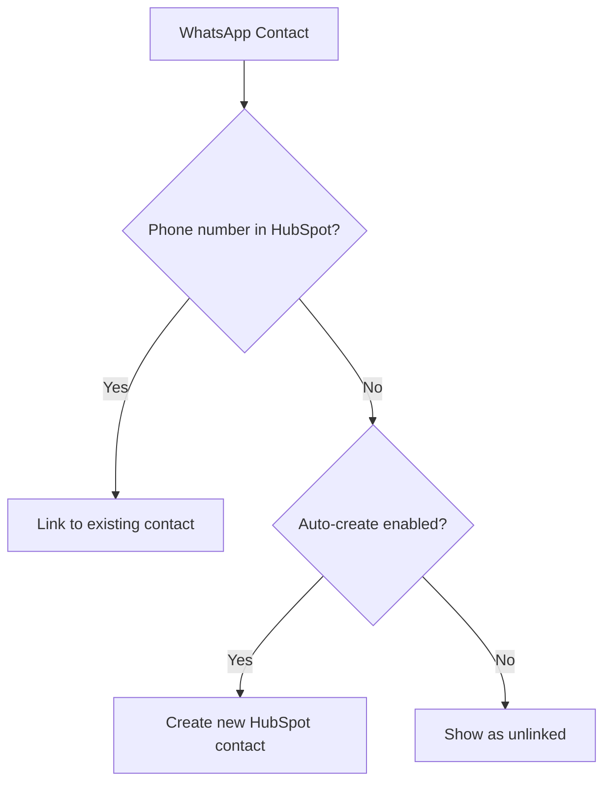

## How Contact Matching Works

Eazybe matches WhatsApp contacts with HubSpot contacts using phone numbers.

### Matching Logic

### Phone Number Formatting

Eazybe normalizes phone numbers for matching:

| WhatsApp Format | Normalized | Matches HubSpot |
|-----------------|------------|-----------------|
| +1 555 123 4567 | 15551234567 | +15551234567 |
| (555) 123-4567 | 5551234567 | 555-123-4567 |
| +91 98765 43210 | 919876543210 | +91 9876543210 |

<Info>
  Phone numbers are matched regardless of formatting. Country codes are preserved.
</Info>

## Automatic Contact Creation

When enabled, Eazybe creates HubSpot contacts for new WhatsApp conversations.

### Default Properties

| HubSpot Property | Source |
|------------------|--------|
| Phone | WhatsApp number |
| First Name | WhatsApp profile name (if available) |
| Contact Owner | Rep who created the contact |
| Lifecycle Stage | Configured default (typically "Lead") |
| Lead Source | "WhatsApp" |

### Enabling Auto-Create

1. Go to **Settings** → **HubSpot** → **Contact Sync**
2. Toggle **Auto-create contacts** to On
3. Set default lifecycle stage
4. Save changes

## Manual Contact Creation

To create a HubSpot contact manually from WhatsApp:

<Steps>
  <Step title="Open the Chat">
    Navigate to the WhatsApp conversation.
  </Step>
  <Step title="Click HubSpot Icon">
    Click the HubSpot icon in the Eazybe sidebar.
  </Step>
  <Step title="Click Create Contact">
    Click the **Create Contact** button.
  </Step>
  <Step title="Fill Details">
    Enter contact properties (name, email, etc.).
    Phone number is auto-filled from WhatsApp.
  </Step>
  <Step title="Save">
    Click **Save** to create the contact in HubSpot.
  </Step>
</Steps>

## Linking Existing Contacts

If a contact exists in HubSpot but isn't matching:

1. Click the HubSpot icon in the chat
2. Click **Link to Existing Contact**
3. Search for the contact by name or email
4. Select the correct contact
5. The phone number will be added to their HubSpot record

## Sync Frequency

| Data Type | Sync Interval |
|-----------|---------------|
| New contacts | Immediate |
| Contact updates | Every 5 minutes |
| Chat backup | Every 3-5 minutes |
| Property changes | Real-time |

## Troubleshooting

<AccordionGroup>
  <Accordion title="Contact not matching despite same phone">
    - Check phone number format in HubSpot
    - Ensure country code is consistent
    - Try adding +country code to HubSpot
  </Accordion>
  <Accordion title="Duplicate contacts created">
    - Review phone number formatting
    - Merge duplicates in HubSpot
    - Check if contact was created before integration
  </Accordion>
</AccordionGroup>

## Next Steps

<CardGroup cols={2}>
  <Card title="Chat Backup" icon="cloud" href="/integrations/hubspot/chat-backup">
    Configure conversation logging
  </Card>
  <Card title="Mini-CRM View" icon="sidebar" href="/integrations/hubspot/mini-crm/overview">
    Manage HubSpot from WhatsApp
  </Card>
</CardGroup>
