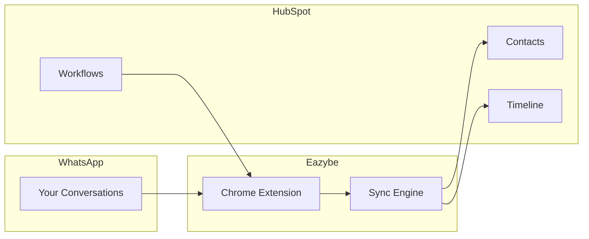

## Overview

Eazybe's HubSpot integration connects your WhatsApp conversations directly to HubSpot CRM, enabling automatic contact sync, chat backup, and workflow automation.

<Frame>
  
</Frame>

## Key Features

<CardGroup cols={2}>
  <Card title="Bidirectional Sync" icon="arrows-rotate">
    Contacts sync automatically between WhatsApp and HubSpot. Create contacts from either platform.
  </Card>
  <Card title="Chat Backup" icon="cloud-arrow-up">
    Every WhatsApp conversation is logged in HubSpot's activity timeline with full message history.
  </Card>
  <Card title="Mini-CRM View" icon="sidebar">
    Access HubSpot contacts, deals, tasks, and tickets directly from WhatsApp without switching tabs.
  </Card>
  <Card title="Workflow Automation" icon="diagram-project">
    Trigger WhatsApp messages from HubSpot workflows for automated follow-ups and notifications.
  </Card>
</CardGroup>

## What You Can Do

### From WhatsApp

With the Eazybe sidebar, you can:

- ✅ Create new HubSpot contacts instantly
- ✅ View and edit existing contact properties
- ✅ Create deals and track pipeline stages
- ✅ Add tasks with due dates and priorities
- ✅ Log calls and add notes
- ✅ Create support tickets
- ✅ See complete CRM history

### From HubSpot

With the integration, HubSpot receives:

- ✅ Automatic chat backup to contact timeline
- ✅ New contacts from WhatsApp conversations
- ✅ Activity logging for all interactions
- ✅ Workflow triggers based on WhatsApp events

## How It Works

1. **Connect** - Link your HubSpot account to Eazybe
2. **Sync** - Contacts match automatically via phone number
3. **Backup** - Conversations log to HubSpot every 3-5 minutes
4. **Automate** - Trigger WhatsApp messages from HubSpot workflows

## Integration Capabilities

| Feature | Free HubSpot | Starter | Professional | Enterprise |
|---------|--------------|---------|--------------|------------|
| Contact sync | ✅ | ✅ | ✅ | ✅ |
| Chat backup | ✅ | ✅ | ✅ | ✅ |
| Mini-CRM view | ✅ | ✅ | ✅ | ✅ |
| Deal management | ✅ | ✅ | ✅ | ✅ |
| Task creation | ✅ | ✅ | ✅ | ✅ |
| Ticket creation | ✅ | ✅ | ✅ | ✅ |
| Workflow actions | ❌ | ❌ | ✅ | ✅ |
| Dynamic labels | ❌ | ❌ | ✅ | ✅ |

<Info>
  Workflow automation requires HubSpot Professional or Enterprise. All other features work with any HubSpot plan, including Free.
</Info>

## Quick Start

<Steps>
  <Step title="Prerequisites">
    Ensure you have:
    - Eazybe Chrome extension installed
    - HubSpot account (any plan)
    - Admin access to HubSpot (for initial setup)
  </Step>
  
  <Step title="Connect HubSpot">
    1. Open WhatsApp Web with Eazybe active
    2. Click **Settings** → **Integrations**
    3. Select **HubSpot** and click **Connect**
    4. Authorize Eazybe in the HubSpot popup
  </Step>
  
  <Step title="Start Using">
    - Click the HubSpot icon in any chat to view/create contacts
    - Conversations will start syncing automatically
    - Check HubSpot timeline to see backed-up chats
  </Step>
</Steps>

[Full setup guide →](/integrations/hubspot/setup)

## What Gets Synced

### Contact Properties Synced

| WhatsApp | HubSpot |
|----------|---------|
| Phone number | Phone |
| Profile name | First Name (if no match) |
| Profile picture | Contact image |

### Chat Backup Includes

- ✅ Text messages (sent & received)
- ✅ Images and photos
- ✅ Documents (PDF, DOC, etc.)
- ✅ Voice messages (as attachments)
- ✅ Message timestamps
- ✅ Read receipts
- ❌ Video files (too large)
- ❌ Stickers

## Use Cases

<AccordionGroup>
  <Accordion title="Sales Follow-up Automation">
    **Scenario:** Auto-send WhatsApp when a deal moves to a specific stage
    
    **Setup:**
    1. Create HubSpot workflow triggered by deal stage change
    2. Add Eazybe "Send WhatsApp" action
    3. Configure message template
    
    **Result:** Prospects receive timely WhatsApp follow-ups automatically
  </Accordion>
  
  <Accordion title="Lead Capture from WhatsApp">
    **Scenario:** Create HubSpot contacts from new WhatsApp conversations
    
    **Setup:**
    1. Enable "Auto-create contacts" in Eazybe settings
    2. Map contact properties
    3. Set default lifecycle stage
    
    **Result:** Every new WhatsApp contact becomes a HubSpot lead
  </Accordion>
  
  <Accordion title="Sales Activity Tracking">
    **Scenario:** Log all WhatsApp interactions in HubSpot
    
    **Setup:**
    1. Enable chat backup in Eazybe settings
    2. Configure sync frequency (default: 5 minutes)
    3. View in HubSpot contact timeline
    
    **Result:** Complete conversation history in HubSpot for reporting
  </Accordion>
  
  <Accordion title="Dynamic Lead Labeling">
    **Scenario:** Auto-label WhatsApp contacts based on HubSpot properties
    
    **Setup:**
    1. Create Dynamic Label in Eazybe
    2. Set rule: "Lifecycle Stage = Customer"
    3. Label is auto-applied/removed as property changes
    
    **Result:** WhatsApp labels always match HubSpot data
  </Accordion>
</AccordionGroup>

## Support & Resources

<CardGroup cols={3}>
  <Card title="Setup Guide" icon="book" href="/integrations/hubspot/setup">
    Step-by-step installation
  </Card>
  <Card title="Troubleshooting" icon="wrench" href="/integrations/hubspot/troubleshooting">
    Common issues & fixes
  </Card>
  <Card title="FAQ" icon="circle-question" href="/integrations/hubspot/faq">
    Frequently asked questions
  </Card>
</CardGroup>

## Next Steps

<CardGroup cols={2}>
  <Card
    title="Setup HubSpot"
    icon="plug"
    href="/integrations/hubspot/setup"
  >
    Connect your HubSpot account
  </Card>
  <Card
    title="Mini-CRM View"
    icon="sidebar"
    href="/integrations/hubspot/mini-crm/overview"
  >
    Use HubSpot inside WhatsApp
  </Card>
  <Card
    title="Workflow Automation"
    icon="diagram-project"
    href="/integrations/hubspot/workflows"
  >
    Automate WhatsApp messages
  </Card>
  <Card
    title="Dynamic Labels"
    icon="tags"
    href="/integrations/hubspot/dynamic-labels"
  >
    Sync labels with HubSpot properties
  </Card>
</CardGroup>
