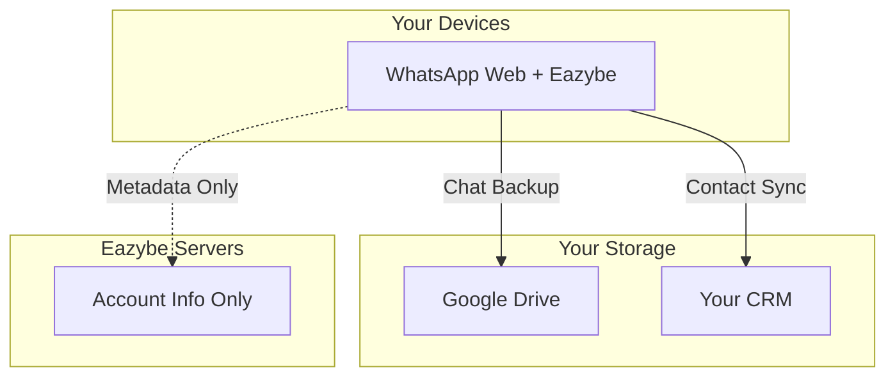

## Storage Architecture

Eazybe uses a privacy-first architecture where your sensitive data never touches our servers.

## What's Stored Where

### Your Google Drive

| Data Type | Stored | Your Control |
|-----------|--------|--------------|
| WhatsApp messages | ✅ | Full access |
| Images & media | ✅ | Full access |
| Documents | ✅ | Full access |
| Voice notes | ✅ | Full access |

**Location**: "Eazybe Backups" folder in admin's Google Drive

### Your CRM

| Data Type | Stored | Your Control |
|-----------|--------|--------------|
| Contact records | ✅ | Per CRM permissions |
| Conversation timeline | ✅ | Per CRM permissions |
| Notes & tasks | ✅ | Per CRM permissions |
| Attachments | ✅ | Per CRM permissions |

### Eazybe Servers

| Data Type | Stored | Purpose |
|-----------|--------|---------|
| Account email | ✅ | Authentication |
| Organization settings | ✅ | Configuration |
| Team structure | ✅ | Access control |
| Anonymized analytics | ✅ | Service improvement |
| **Message content** | ❌ | **Never stored** |

## Security Measures

### Encryption

| Data State | Protection |
|------------|------------|
| In Transit | TLS 1.3 |
| At Rest | AES-256 |
| API Calls | OAuth 2.0 + API keys |
| Passwords | bcrypt hashing |

### Access Control

- Role-based access control (RBAC)
- Two-factor authentication available
- Session management with automatic timeout
- Audit logging for sensitive operations

### Infrastructure

- SOC 2 Type II compliant infrastructure
- 24/7 security monitoring
- Regular penetration testing
- Encrypted, geographically distributed backups

## Excluding Personal Conversations

Team members can exclude personal chats from backup:

<Steps>
  <Step title="Create Label">
    Create a label named "Personal" or "Don't Sync"
  </Step>
  <Step title="Configure">
    Go to Backup Settings → Set label to "Don't Sync"
  </Step>
  <Step title="Apply">
    Apply label to personal conversations
  </Step>
</Steps>

## Data Deletion

### Delete Account

1. Go to Settings → Account → Delete Account
2. Confirm deletion
3. Account data removed from Eazybe servers
4. Google Drive & CRM data remains (your property)

### Delete Backups

1. Access your Google Drive
2. Navigate to "Eazybe Backups" folder
3. Delete specific conversations or entire folder
4. Eazybe cannot recover deleted Drive data
