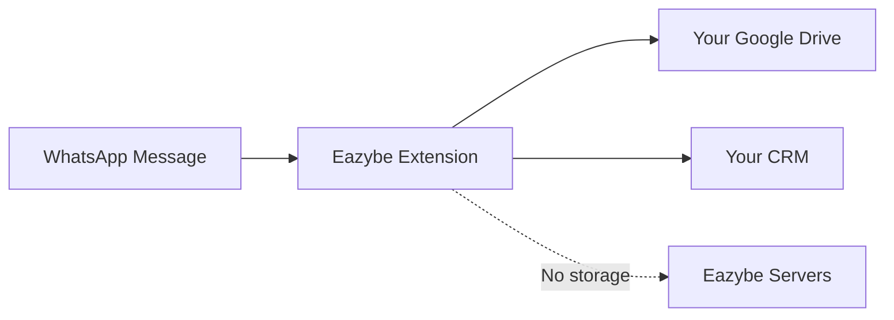

## Our Commitment

Eazybe is committed to protecting your data and ensuring compliance with global privacy regulations including GDPR, CCPA, and WhatsApp's Business policies.

<Info>
  **Need a DPA?** Request a Data Processing Agreement at [dpa@eazybe.com](mailto:dpa@eazybe.com)
</Info>

## Data Storage Architecture

### Where Your Data Lives

| Data Type | Storage Location | Eazybe Access |
|-----------|------------------|---------------|
| WhatsApp Messages | Your Google Drive | ❌ No access |
| CRM Data | Your CRM (HubSpot, Zoho, etc.) | ❌ No access |
| Attachments | Your Google Drive / CRM | ❌ No access |
| User Account Info | Eazybe servers (encrypted) | ✅ Required |
| Usage Analytics | Eazybe servers (anonymized) | ✅ Anonymized |

<Warning>
  **Important**: Eazybe does NOT store your WhatsApp message content on our servers. All chat data is stored in YOUR Google Drive and connected CRM.
</Warning>

### How Chat Backup Works

1. Message sent/received on WhatsApp
2. Eazybe extension processes locally
3. Backup goes to YOUR Google Drive (admin's account)
4. Sync goes to YOUR connected CRM
5. **Nothing stored on Eazybe servers**

## Key Privacy Features

<CardGroup cols={2}>
  <Card title="Zero Message Storage" icon="database">
    We never store your WhatsApp messages on our servers
  </Card>
  <Card title="Your Storage, Your Control" icon="key">
    Data lives in your Google Drive and CRM accounts
  </Card>
  <Card title="Label-Based Privacy" icon="eye-slash">
    Exclude personal chats from backup using labels
  </Card>
  <Card title="Encryption" icon="lock">
    All data encrypted in transit and at rest
  </Card>
</CardGroup>

## Legal Documents

<CardGroup cols={2}>
  <Card title="Privacy Policy" icon="file-contract" href="https://eazybe.com/privacy-policy">
    Full privacy policy
  </Card>
  <Card title="Terms of Service" icon="file-lines" href="https://eazybe.com/terms-of-service">
    Terms and conditions
  </Card>
  <Card title="Master Subscription Agreement" icon="file-signature" href="https://eazybe.com/master-subscription-agreement">
    Enterprise agreement
  </Card>
  <Card title="DPA Request" icon="file-shield" href="mailto:dpa@eazybe.com">
    Request Data Processing Agreement
  </Card>
</CardGroup>

## Contact

For privacy inquiries:
- **Email**: [privacy@eazybe.com](mailto:privacy@eazybe.com)
- **DPA Requests**: [dpa@eazybe.com](mailto:dpa@eazybe.com)
- **Security Issues**: [security@eazybe.com](mailto:security@eazybe.com)
