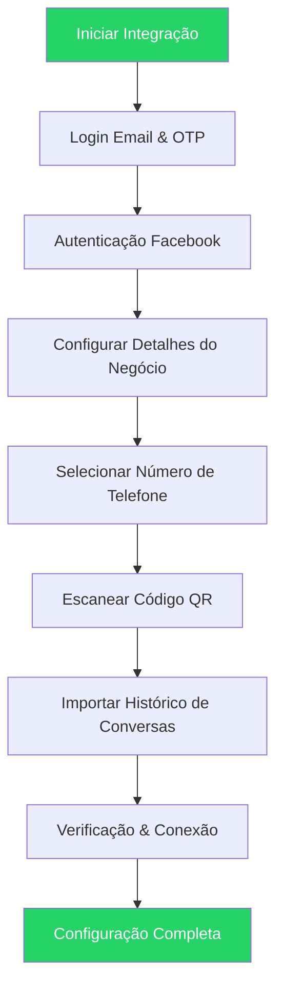

O WhatsApp Coexistence permite que empresas conectem seu número ativo do WhatsApp Business App à WhatsApp Cloud API sem perder conversas, contatos ou precisar de re-registro. Este guia orienta você através do processo completo de integração.

## O Que Você Fará

- Conectar seu número do WhatsApp Business App à Cloud API
- Importar seus contatos e histórico de conversas existentes
- Completar a verificação com a Meta Business Platform
- Começar a usar tanto o WhatsApp Business App quanto a API simultaneamente

## Antes de Começar

<CardGroup cols={2}>

<Card title="WhatsApp Business App" icon="whatsapp">
  Deve ser versão **2.24.17 ou superior**. Números pessoais do WhatsApp não são suportados.
</Card>

<Card title="Número Ativo" icon="phone">
  Atividade regular no WhatsApp sem restrições da Meta ou violações de políticas.
</Card>

<Card title="Conta Meta Business" icon="meta">
  Uma Conta Meta Business com acesso de administrador a uma Página do Facebook Business.
</Card>

<Card title="Número Elegível" icon="check">
  Não vinculado a outro provedor de API do WhatsApp. Números da Nigéria e África do Sul podem ter restrições.
</Card>

</CardGroup>

<Warning>
Números inativos ou restritos frequentemente falham na configuração. Certifique-se de que sua conta WhatsApp Business mostre uso ativo com conversas reais 1:1 por pelo menos 3-7 dias antes de tentar a integração Coexistence.
</Warning>

## Visão Geral do Fluxo

## Processo de Integração Passo a Passo

<Steps>

<Step title="Login por Email">
Digite seu endereço de email e faça login com sua conta.

<Frame>
  
</Frame>
</Step>

<Step title="Verificação OTP">
Digite o OTP (Senha de Uso Único) que será enviado para sua caixa de entrada do Gmail.

<Frame>
  
</Frame>
</Step>

<Step title="Começar">
Clique em **Adicionar Número** para prosseguir com o processo de cadastro incorporado.

<Frame>
  
</Frame>
</Step>

<Step title="Login do Facebook">
Digite suas credenciais de login do Facebook. Você pode usar **Continuar como** se seu login já estiver salvo.

<Frame>
  
</Frame>
</Step>

<Step title="Revisar Permissões">
Revise as permissões solicitadas e clique em **Continuar** para prosseguir.

<Frame>
  
</Frame>
</Step>

<Step title="Inserir Detalhes do Negócio">
Preencha os detalhes do seu negócio conforme exigido pelo formulário.

<Frame>
  
</Frame>
</Step>

<Step title="Selecionar Portfólio de Negócios">
Escolha um portfólio de negócios existente ou crie um novo.

<Note>
Sempre crie uma **NOVA conta WABA** para Coexistence para garantir uso fresco e um fluxo saudável.
</Note>

<Frame>
  
</Frame>
</Step>

<Step title="Escolher Método de Integração">
Selecione uma das duas opções disponíveis:

<Tabs>
<Tab title="Número Existente">
Conecte seu número existente do WhatsApp Business à Cloud API.
</Tab>
<Tab title="Novo Número">
Comece com um novo número de contato do WhatsApp.
</Tab>
</Tabs>

**Restrições importantes:**
- O número não deve estar atualmente vinculado a nenhum outro parceiro
- O número deve ser um novo ou existente número do WhatsApp Business
- O número não deve estar bloqueado pela Meta

<Frame>
  
</Frame>
</Step>

<Step title="Inserir Número de Telefone">
Escolha seu código de país, insira seu número de telefone e clique em **Próximo**.

<Frame>
  
</Frame>
</Step>

<Step title="Escanear Código QR">
Uma mensagem do WhatsApp será enviada para seu número. Clique em **Escanear Código QR** para escanear o código QR exibido na tela principal.

<Frame>
  
</Frame>
</Step>

<Step title="Importação do Histórico de Conversas">
Escolha o que importar:

- **Contatos**: Importados automaticamente
- **Conversas 1:1**: Opcional, até 6 meses
- **Mídia**: Opcional, até 2 semanas

<Note>
Conversas em grupo não são importadas durante a integração Coexistence.
</Note>

<Frame>
  
</Frame>
</Step>

<Step title="Verificação & Conexão">
Aguarde a verificação da conta ser completada. O sistema levará algum tempo para conectar sua conta.

<Frame>
  
</Frame>
</Step>

<Step title="Completar Configuração">
Clique em **Finalizar** quando a configuração estiver concluída. Seu número do WhatsApp Business agora está conectado à Cloud API.

<Frame>
  
</Frame>
</Step>

</Steps>

## O Que é WhatsApp Coexistence?

O Coexistence permite que empresas:

- Conectem o WhatsApp Business App à Cloud API
- Continuem usando o Business App normalmente
- Sincronizem mensagens e contatos em uma plataforma Cloud API
- Evitem re-registrar o número
- Preservem o selo Verificado (se aplicável)

### Principais Benefícios

| Benefício | Descrição |
|-----------|-----------|
| Acesso Duplo | Use o mesmo número de telefone tanto no WhatsApp Business App quanto na API |
| Sincronização em Tempo Real | Mensagens e contatos sincronizam automaticamente |
| Abordagem Híbrida | Use o app móvel para conversas 1:1, API para mensagens em massa |
| Preservação de Dados | Preserve histórico de conversas e contatos sem perda de dados |
| Interface Familiar | Mantenha acesso à interface do WhatsApp Business App |

<Tip>
Este é o método mais seguro para migrar para a Cloud API sem perder dados.
</Tip>

## Solução de Problemas

<AccordionGroup>

<Accordion title="Integração Falhou">
**Razões comuns:**
- Versão antiga do WhatsApp (deve ser 2.24.17 ou superior)
- Inatividade do número
- Restrições da Meta na conta
- Sem acesso de administrador à Página do Facebook

**Solução:** Use outro número que tenha uso ativo do WhatsApp Business sem violações anteriores.
</Accordion>

<Accordion title="Histórico de Conversas Não Foi Importado">
Se a importação de conversas falhar:

1. Abra o WhatsApp Business App
2. Vá para **Configurações** > **Ferramentas de Negócios** > **WhatsApp Business Platform**
3. Toque em **Desconectar**
4. Reinicie o processo de integração Coexistence

<Warning>
Se você pulou manualmente a importação do histórico inicialmente, você deve desconectar completamente e conectar novamente para importar o histórico de conversas.
</Warning>
</Accordion>

<Accordion title="Número Tem Restrições da Meta">
**Sintomas:**
- Integração Coexistence falha instantaneamente
- Código QR não completa
- Mensagem "Conectar à Business Platform" não aparece

**Solução:** Use um novo número com:
- Zero problemas de política
- Atividade frequente e legítima no WhatsApp Business
</Accordion>

</AccordionGroup>

## Perguntas Frequentes

<AccordionGroup>

<Accordion title="Posso usar um número pessoal do WhatsApp?">
Não. Apenas números do WhatsApp Business App são permitidos para Coexistence.
</Accordion>

<Accordion title="Minhas conversas permanecerão no app do meu telefone?">
Sim. Nada é excluído do WhatsApp Business App. Suas conversas existentes permanecem acessíveis.
</Accordion>

<Accordion title="Posso continuar usando o WhatsApp Business App após o Coexistence?">
Sim, você pode continuar usando o WhatsApp Business App normalmente enquanto também usa a Cloud API.
</Accordion>

</AccordionGroup>

## Próximos Passos

<CardGroup cols={2}>

<Card title="Visão Geral WABA" icon="book" href="/pt/waba/overview">
  Saiba mais sobre as capacidades da WhatsApp Business API
</Card>

<Card title="Modo Coexistence" icon="code-branch" href="/pt/getting-started/coexistence-mode">
  Entenda como o modo Coexistence funciona
</Card>

<Card title="Conectar WABA" icon="plug" href="/pt/waba/connect-waba">
  Conecte sua Conta WhatsApp Business ao Eazybe
</Card>

<Card title="Solução de Problemas" icon="screwdriver-wrench" href="/pt/troubleshooting/sync-issues">
  Obtenha ajuda com problemas comuns
</Card>

</CardGroup>
