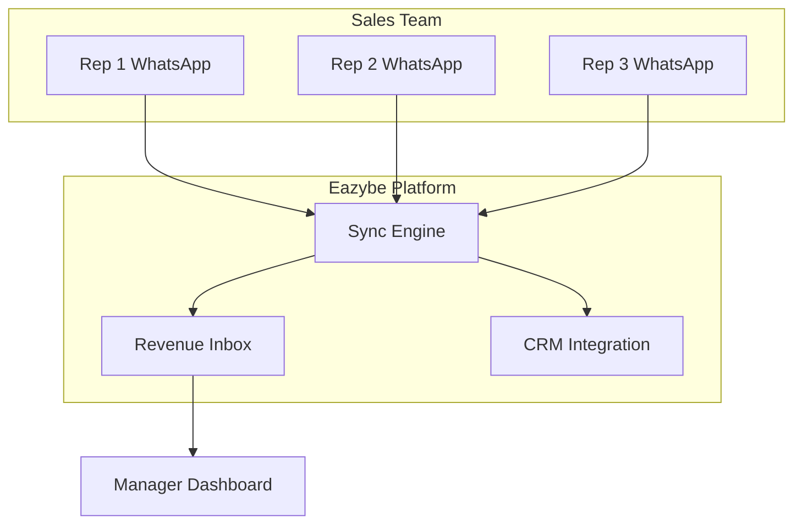

## What is Revenue Inbox?

Revenue Inbox is Eazybe's centralized dashboard that gives sales managers complete visibility into all team WhatsApp conversations. Monitor your reps, identify hot deals, track response times, and ensure no lead falls through the cracks.

<Frame>
  
</Frame>

## Key Capabilities

<CardGroup cols={2}>
  <Card title="Team Monitoring" icon="users">
    View all conversations from every team member in one place without accessing their phones.
  </Card>
  <Card title="AI-Powered Insights" icon="brain">
    Automatically identify hot deals, escalations, and conversations needing attention.
  </Card>
  <Card title="Performance Tracking" icon="chart-line">
    Track response times, message volumes, and team productivity metrics.
  </Card>
  <Card title="Centralized Management" icon="sitemap">
    Assign conversations, add labels, and manage follow-ups across the entire team.
  </Card>
</CardGroup>

## Who Uses Revenue Inbox?

| Role | Use Case |
|------|----------|
| **Sales Manager** | Monitor rep activity, identify coaching opportunities, ensure SLA compliance |
| **RevOps** | Analyze team performance, optimize workflows, report on metrics |
| **Team Lead** | Distribute leads, manage workload, track deal progress |
| **Admin** | Configure settings, manage access, ensure data compliance |

## How It Works

1. **Team members** use the Eazybe Chrome extension on WhatsApp Web
2. **Conversations sync** automatically to the Revenue Inbox
3. **Managers access** the dashboard to view all team conversations
4. **Data flows** to your CRM for complete record-keeping

## Core Features

### Conversation View

See every conversation across your team:
- Filter by team member, date, label, or status
- Search conversations by contact name or content
- View conversation history without leaving the dashboard
- Reply directly from Revenue Inbox (requires permission)

### AI Classification

Our AI automatically categorizes conversations:

| Classification | Description |
|---------------|-------------|
| 🔥 Hot Deal | High buying intent detected |
| ⚠️ Escalation | Customer frustration or urgent issue |
| ⏰ Follow-up Needed | Awaiting response for 24+ hours |
| ✅ Resolved | Conversation concluded |
| 💤 Cold | Low engagement or inactive |

### Team Performance

Track key metrics at a glance:
- Average response time
- Messages sent/received per rep
- Conversations handled per day
- First response time
- Resolution rate

### Labels & Organization

Organize conversations across your team:
- Create custom labels (Hot Lead, Qualified, Negotiation, etc.)
- Apply labels to categorize deals
- Filter by label to see pipeline stages
- Sync labels with CRM properties

## Access Levels

Revenue Inbox supports role-based access:

| Role | View Own Chats | View Team Chats | Manage Settings |
|------|----------------|-----------------|-----------------|
| Employee | ✅ | ❌ | ❌ |
| Manager | ✅ | ✅ (own team) | ❌ |
| Admin | ✅ | ✅ (all teams) | ✅ |

<Info>
  Employees can only see their own conversations in Revenue Inbox. Manager and Admin roles are required to view team conversations.
</Info>

## Privacy & Compliance

Revenue Inbox is designed with privacy in mind:

- **No phone access required** - Works via WhatsApp Web, not mobile phones
- **Transparent monitoring** - Team members know conversations are synced
- **Data stays in your control** - Synced to your own CRM
- **GDPR compliant** - Data handling follows privacy regulations
- **Admin controls** - Configure what data is visible and to whom

<Warning>
  Ensure your team is informed about conversation monitoring as per your company policy and local regulations.
</Warning>

## Getting Started

<Steps>
  <Step title="Set Up Your Workspace">
    Create an Eazybe organization and configure your settings.
  </Step>
  <Step title="Invite Team Members">
    Add employees to your workspace and assign roles.
  </Step>
  <Step title="Team Installs Extension">
    Each team member installs Eazybe Chrome extension and connects WhatsApp.
  </Step>
  <Step title="Access Revenue Inbox">
    Log in to [workspace.eazybe.com](https://workspace.eazybe.com) to view the dashboard.
  </Step>
</Steps>

## Use Cases

<AccordionGroup>
  <Accordion title="Sales Team Monitoring">
    Track how your sales reps engage with leads:
    - See all ongoing deals in one view
    - Identify reps who need coaching
    - Ensure timely follow-ups
    - Prevent lead leakage
  </Accordion>
  
  <Accordion title="Customer Support Oversight">
    Manage support conversations:
    - Track ticket resolution times
    - Identify escalations quickly
    - Monitor customer satisfaction
    - Ensure consistent responses
  </Accordion>
  
  <Accordion title="Field Sales Management">
    Oversee remote/field teams:
    - View conversations from reps using personal phones
    - Maintain visibility without physical access
    - Ensure company data is captured
    - Prevent poaching when reps leave
  </Accordion>
  
  <Accordion title="Compliance & Quality">
    Maintain standards:
    - Review conversations for compliance
    - Ensure messaging guidelines are followed
    - Document interactions for audits
    - Train team based on real conversations
  </Accordion>
</AccordionGroup>

## Next Steps

<CardGroup cols={2}>
  <Card
    title="Dashboard Tour"
    icon="compass"
    href="/revenue-inbox/dashboard"
  >
    Learn the Revenue Inbox interface
  </Card>
  <Card
    title="Manage Conversations"
    icon="comments"
    href="/revenue-inbox/viewing-conversations"
  >
    Filter, search, and view chats
  </Card>
  <Card
    title="Set Up Labels"
    icon="tags"
    href="/revenue-inbox/labels"
  >
    Organize with custom labels
  </Card>
  <Card
    title="Track Performance"
    icon="chart-bar"
    href="/revenue-inbox/performance-metrics"
  >
    Monitor team metrics
  </Card>
</CardGroup>
