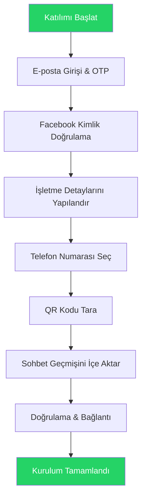

WhatsApp Coexistence, işletmelerin aktif WhatsApp Business App telefon numaralarını sohbetleri, kişileri kaybetmeden veya yeniden kayıt gerektirmeden WhatsApp Cloud API'ye bağlamalarını sağlar. Bu kılavuz, tam katılım sürecini adım adım açıklar.

## Ne Yapacaksınız

- WhatsApp Business App numaranızı Cloud API'ye bağlama
- Mevcut kişilerinizi ve sohbet geçmişinizi içe aktarma
- Meta Business Platform ile doğrulamayı tamamlama
- Hem WhatsApp Business App hem de API'yi aynı anda kullanmaya başlama

## Başlamadan Önce

<CardGroup cols={2}>

<Card title="WhatsApp Business App" icon="whatsapp">
  **2.24.17 veya daha yeni** sürüm olmalıdır. Kişisel WhatsApp numaraları desteklenmez.
</Card>

<Card title="Aktif Telefon Numarası" icon="phone">
  Meta kısıtlamaları veya politika ihlalleri olmadan düzenli WhatsApp etkinliği.
</Card>

<Card title="Meta Business Hesabı" icon="meta">
  Facebook Business Sayfasına yönetici erişimi olan bir Meta Business Hesabı.
</Card>

<Card title="Uygun Numara" icon="check">
  Başka bir WhatsApp API sağlayıcısına bağlı olmamalıdır. Nijerya ve Güney Afrika numaralarında kısıtlamalar olabilir.
</Card>

</CardGroup>

<Warning>
Aktif olmayan veya kısıtlı numaralar kurulumda sıklıkla başarısız olur. Coexistence katılımını denemeden önce WhatsApp Business hesabınızın en az 3-7 gün boyunca gerçek 1:1 sohbetlerle aktif kullanım gösterdiğinden emin olun.
</Warning>

## Akış Genel Bakışı

## Adım Adım Katılım Süreci

<Steps>

<Step title="E-posta Girişi">
E-posta adresinizi girin ve hesabınızla giriş yapın.

<Frame>
  
</Frame>
</Step>

<Step title="OTP Doğrulama">
Gmail gelen kutunuza gönderilecek OTP'yi (Tek Kullanımlık Şifre) girin.

<Frame>
  
</Frame>
</Step>

<Step title="Başla">
Gömülü kayıt sürecine devam etmek için **Numara Ekle**'ye tıklayın.

<Frame>
  
</Frame>
</Step>

<Step title="Facebook Girişi">
Facebook giriş bilgilerinizi girin. Girişiniz zaten kaydedilmişse **Olarak Devam Et**'i kullanabilirsiniz.

<Frame>
  
</Frame>
</Step>

<Step title="İzinleri İncele">
İstenen izinleri inceleyin ve devam etmek için **Devam Et**'e tıklayın.

<Frame>
  
</Frame>
</Step>

<Step title="İşletme Detaylarını Girin">
Formun gerektirdiği şekilde işletme detaylarınızı doldurun.

<Frame>
  
</Frame>
</Step>

<Step title="İşletme Portföyü Seç">
Mevcut bir işletme portföyü seçin veya yeni bir tane oluşturun.

<Note>
Taze kullanım ve sağlıklı akış sağlamak için Coexistence için her zaman **YENİ WABA hesabı** oluşturun.
</Note>

<Frame>
  
</Frame>
</Step>

<Step title="Katılım Yöntemini Seç">
Mevcut iki seçenekten birini seçin:

<Tabs>
<Tab title="Mevcut Numara">
Mevcut WhatsApp Business numaranızı Cloud API'ye bağlayın.
</Tab>
<Tab title="Yeni Numara">
Yeni bir WhatsApp iletişim numarasıyla başlayın.
</Tab>
</Tabs>

**Önemli kısıtlamalar:**
- Numara şu anda başka bir ortağa bağlı olmamalıdır
- Numara yeni veya mevcut bir WhatsApp Business numarası olmalıdır
- Numara Meta tarafından engellenmemiş olmalıdır

<Frame>
  
</Frame>
</Step>

<Step title="Telefon Numarası Girin">
Ülke kodunuzu seçin, telefon numaranızı girin ve **İleri**'ye tıklayın.

<Frame>
  
</Frame>
</Step>

<Step title="QR Kodu Tara">
Numaranıza bir WhatsApp mesajı gönderilecektir. Ana ekranda görüntülenen QR kodunu taramak için **QR Kodu Tara**'ya tıklayın.

<Frame>
  
</Frame>
</Step>

<Step title="Sohbet Geçmişi İçe Aktarımı">
Ne içe aktarılacağını seçin:

- **Kişiler**: Otomatik olarak içe aktarılır
- **1:1 Sohbetler**: İsteğe bağlı, 6 aya kadar
- **Medya**: İsteğe bağlı, 2 haftaya kadar

<Note>
Grup sohbetleri Coexistence katılımı sırasında içe aktarılmaz.
</Note>

<Frame>
  
</Frame>
</Step>

<Step title="Doğrulama & Bağlantı">
Hesap doğrulamasının tamamlanmasını bekleyin. Sistem hesabınızı bağlamak için biraz zaman alacaktır.

<Frame>
  
</Frame>
</Step>

<Step title="Kurulumu Tamamla">
Kurulum tamamlandığında **Bitir**'e tıklayın. WhatsApp Business numaranız artık Cloud API'ye bağlı.

<Frame>
  
</Frame>
</Step>

</Steps>

## WhatsApp Coexistence Nedir?

Coexistence, işletmelerin şunları yapmasına olanak tanır:

- WhatsApp Business App'i Cloud API'ye bağlama
- Business App'i normal şekilde kullanmaya devam etme
- Mesajları ve kişileri Cloud API platformuna senkronize etme
- Numarayı yeniden kaydetmekten kaçınma
- Doğrulanmış rozetini koruma (varsa)

### Temel Faydalar

| Fayda | Açıklama |
|-------|----------|
| Çift Erişim | Aynı telefon numarasını hem WhatsApp Business App hem de API'de kullanın |
| Gerçek Zamanlı Senkronizasyon | Mesajlar ve kişiler otomatik olarak senkronize olur |
| Hibrit Yaklaşım | 1:1 sohbetler için mobil uygulamayı, toplu mesajlaşma için API'yi kullanın |
| Veri Koruma | Sohbet geçmişini ve kişileri veri kaybı olmadan koruyun |
| Tanıdık Arayüz | WhatsApp Business App arayüzüne erişimi sürdürün |

<Tip>
Bu, veri kaybı olmadan Cloud API'ye geçiş yapmanın en güvenli yöntemidir.
</Tip>

## Sorun Giderme

<AccordionGroup>

<Accordion title="Entegrasyon Başarısız Oldu">
**Yaygın nedenler:**
- Eski WhatsApp sürümü (2.24.17 veya daha yeni olmalı)
- Numara inaktifliği
- Hesapta Meta kısıtlamaları
- Facebook Sayfasına yönetici erişimi yok

**Çözüm:** Geçmiş ihlalleri olmayan aktif WhatsApp Business kullanımına sahip başka bir numara kullanın.
</Accordion>

<Accordion title="Sohbet Geçmişi İçe Aktarılmadı">
Sohbet içe aktarımı başarısız olursa:

1. WhatsApp Business App'i açın
2. **Ayarlar** > **İşletme Araçları** > **WhatsApp Business Platform**'a gidin
3. **Bağlantıyı Kes**'e dokunun
4. Coexistence katılım sürecini yeniden başlatın

<Warning>
Başlangıçta geçmiş içe aktarımını manuel olarak atladıysanız, sohbet geçmişini içe aktarmak için tamamen bağlantıyı kesip yeniden bağlanmanız gerekir.
</Warning>
</Accordion>

<Accordion title="Numarada Meta Kısıtlamaları Var">
**Belirtiler:**
- Coexistence katılımı anında başarısız oluyor
- QR kodu tamamlanmıyor
- "Business Platform'a Bağlan" mesajı görünmüyor

**Çözüm:** Şunlara sahip yeni bir numara kullanın:
- Sıfır politika sorunu
- Sık ve meşru WhatsApp Business etkinliği
</Accordion>

</AccordionGroup>

## Sık Sorulan Sorular

<AccordionGroup>

<Accordion title="Kişisel WhatsApp numarası kullanabilir miyim?">
Hayır. Coexistence için yalnızca WhatsApp Business App numaraları izinlidir.
</Accordion>

<Accordion title="Sohbetlerim telefon uygulamanda kalacak mı?">
Evet. WhatsApp Business App'ten hiçbir şey silinmez. Mevcut sohbetleriniz erişilebilir kalır.
</Accordion>

<Accordion title="Coexistence sonrası WhatsApp Business App'i kullanmaya devam edebilir miyim?">
Evet, Cloud API'yi de kullanırken WhatsApp Business App'i normal şekilde kullanmaya devam edebilirsiniz.
</Accordion>

</AccordionGroup>

## Sonraki Adımlar

<CardGroup cols={2}>

<Card title="WABA Genel Bakış" icon="book" href="/tr/waba/overview">
  WhatsApp Business API yetenekleri hakkında daha fazla bilgi edinin
</Card>

<Card title="Coexistence Modu" icon="code-branch" href="/tr/getting-started/coexistence-mode">
  Coexistence modunun nasıl çalıştığını anlayın
</Card>

<Card title="WABA'yı Bağla" icon="plug" href="/tr/waba/connect-waba">
  WhatsApp Business Hesabınızı Eazybe'ye bağlayın
</Card>

<Card title="Sorun Giderme" icon="screwdriver-wrench" href="/tr/troubleshooting/sync-issues">
  Yaygın sorunlar için yardım alın
</Card>

</CardGroup>
